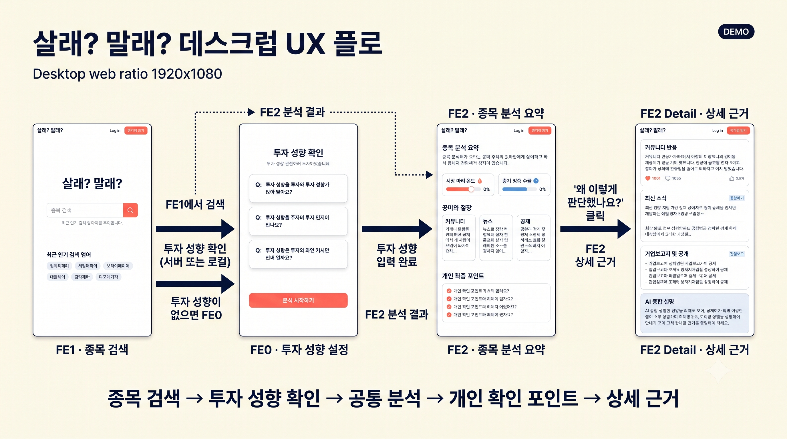
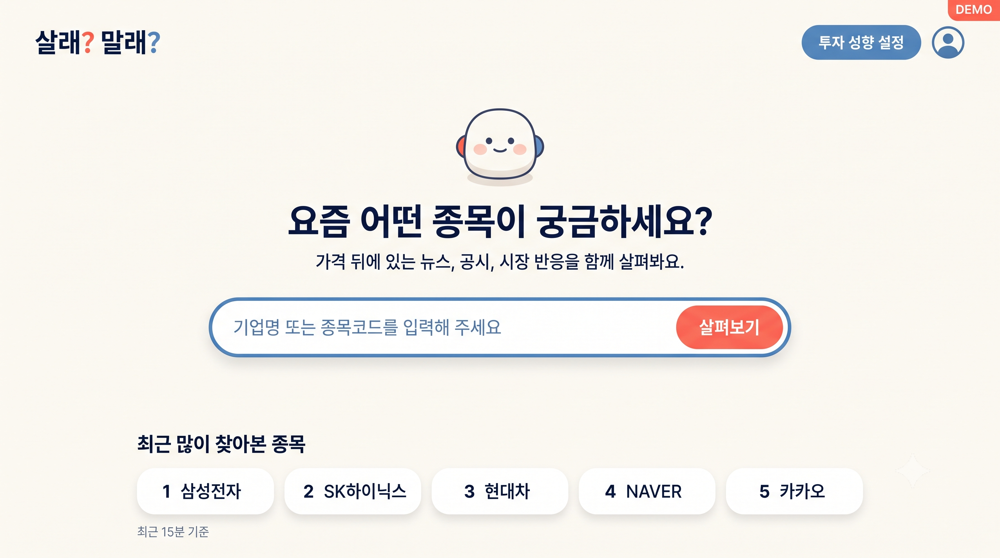
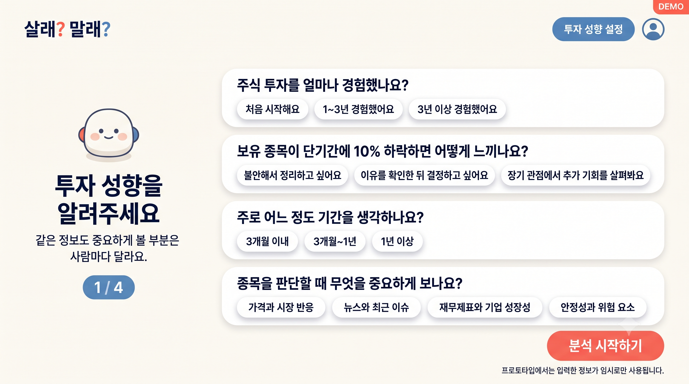
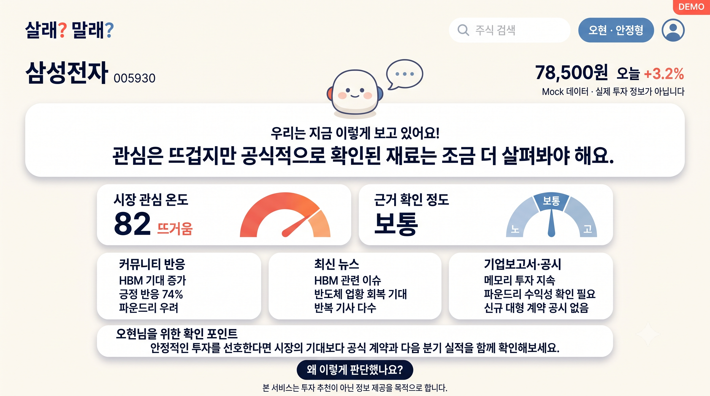
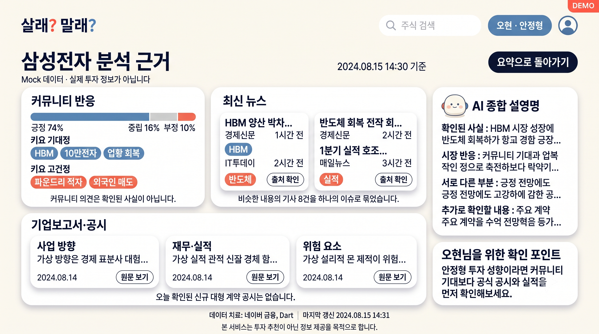

# FE 화면 설계와 사용자 흐름

> 이 문서는 현재 제작한 화면 이미지를 기준으로 팀원들이 서비스의 사용자 흐름, 화면별 목적, 필요한 데이터와 서버 연결을 함께 이해하기 위한 설명서다.
> 이미지는 최종 디자인이 아니라 개발 방향을 맞추기 위한 시안이며, 화면 문구와 수치는 구현 과정에서 변경할 수 있다.

## 1. 서비스 화면의 전체 목적

사용자가 종목을 검색하면 단순한 현재 가격만 보여주는 것이 아니라 다음 내용을 연결해서 보여준다.

- 커뮤니티에서 사람들이 어떤 이야기를 하는지
- 최근 뉴스에서 어떤 이슈가 반복되는지
- 전자공시와 기업보고서에서 공식적으로 확인된 내용이 무엇인지
- 시장의 관심과 공식 근거 사이에 차이가 있는지
- 사용자의 투자 성향에서 어떤 내용을 먼저 확인하면 좋은지

서비스는 주식의 매수·매도를 추천하지 않는다. 사용자가 여러 정보를 직접 비교하고 판단할 수 있도록 `공통 분석`과 `개인 확인 포인트`를 제공한다.

## 2. 전체 화면 흐름



```text
로그인 또는 데모 사용자 선택
  → FE1 종목 검색
  → 투자 성향 존재 여부 확인
     ├─ 투자 성향 있음: 바로 분석 시작
     └─ 투자 성향 없음: FE0 투자 성향 설정
  → FE2 종목 분석 요약
  → FE2 상세 근거
```

이 흐름에서 공통 종목 분석과 사용자 개인화는 분리한다.

```text
공통 종목 분석
├─ 뉴스
├─ 전자공시·기업보고서
├─ 커뮤니티 반응
├─ 시장 관심 온도
└─ 근거 확인 정도

사용자 개인화
└─ 나를 위한 확인 포인트
```

같은 종목을 검색하면 공통 종목 분석은 모든 사용자에게 동일해야 한다. 투자 성향에 따라 달라지는 부분은 `나를 위한 확인 포인트`다.

## 3. FE1 — 종목 검색 화면



### 화면 목적

사용자가 서비스에 들어왔을 때 가장 먼저 보는 화면이다. 궁금한 기업명이나 종목 코드를 입력하여 분석을 시작한다.

### 주요 화면 요소

- `살래? 말래?` 서비스 이름
- 기업명 또는 종목 코드 검색창
- 분석을 시작하는 버튼
- 최근 많이 검색한 종목
- 투자 성향 설정 버튼
- 현재 로그인 사용자 또는 데모 사용자 표시

### 사용자의 행동

1. 기업명 또는 종목 코드를 입력한다.
2. 분석 시작 버튼을 누른다.
3. Backend가 현재 사용자의 투자 성향 등록 여부를 확인한다.
4. 투자 성향이 없으면 FE0으로 이동한다.
5. 투자 성향이 있으면 MCP Client에 분석을 요청한다.

### 필요한 데이터

| 데이터 | 초기 단계 | 실제 단계 |
|---|---|---|
| 로그인 사용자 | 데모 사용자 | 인증된 사용자 |
| 많이 검색한 종목 | Mock 목록 | 검색 기록 집계 |
| 기업 검색 | 삼성전자 중심 Mock | 기업명·종목 코드 검색 API |
| 투자 성향 여부 | Mock 사용자 정보 | Backend와 PostgreSQL 조회 |

### 개발 시 주의점

- Frontend는 종목 API나 MCP를 직접 호출하지 않는다.
- 검색 요청은 Backend로만 전달한다.
- 사용자가 먼저 검색한 뒤 FE0으로 이동하더라도 검색한 종목을 잃지 않아야 한다.
- 검색한 종목은 Frontend 세션 또는 Redis 단기 State에 임시 보관한다.

## 4. FE0 — 투자 성향 설정 화면



### 화면 목적

사용자에게 같은 정보를 제공하더라도 어떤 부분을 중요하게 설명할지 정하기 위한 기초 정보를 받는다.

투자 성향은 종목의 공통 점수나 사실을 변경하기 위한 정보가 아니다. 개인별 확인 포인트를 만드는 데만 사용한다.

### 초기 질문 항목

- 주식 투자 경험
- 단기간 가격 하락에 대한 태도
- 주로 생각하는 투자 기간
- 종목을 판단할 때 중요하게 보는 정보

### 저장할 Memory

```text
experience_level
risk_profile
investment_horizon
preferred_evidence
```

### Mock 단계와 실제 단계

#### Mock 단계

- 사용자가 선택한 값을 현재 세션에 저장한다.
- 또는 데모 사용자 A·B의 고정 투자 성향을 사용한다.
- 실제 회원가입과 복잡한 인증은 구현하지 않아도 된다.

#### 실제 단계

- 인증된 사용자 ID를 기준으로 PostgreSQL에 저장한다.
- 사용자가 자신의 투자 성향을 조회·수정·삭제할 수 있게 한다.
- 요청 본문의 임의 `user_id`를 그대로 신뢰하지 않는다.

### 설정 완료 후 흐름

```text
투자 성향 저장
  → FE1에서 보류된 종목 확인
  → 해당 종목 분석 재개
  → FE2로 이동
```

### 개발 시 주의점

- 투자 성향을 이용해 `매수 적합도`를 만들지 않는다.
- 정확한 자산, 계좌, 카드, 비밀번호, API Key 같은 민감정보는 받거나 Memory에 저장하지 않는다.
- 시안의 질문과 선택지는 팀에서 최종 규격을 정한 뒤 조정할 수 있다.

## 5. FE2 — 종목 분석 요약 화면



### 화면 목적

사용자가 검색한 종목에 대해 현재 시장의 관심과 확인된 근거를 한눈에 비교하도록 돕는 핵심 화면이다.

### 화면 상단

- 기업명과 종목 코드
- 현재 가격과 등락 정보
- 데이터 기준 시각
- 로그인 사용자와 투자 성향
- 다른 종목을 검색할 수 있는 검색창

시안에 표시된 가격과 등락률은 Mock Data이므로 실제 데이터와 혼동되지 않게 표시해야 한다.

### 공통 한줄평

네 MCP 결과를 바탕으로 현재 상황을 한 문장으로 설명한다.

예시:

> 관심은 뜨겁지만 공식적으로 확인된 재료는 조금 더 살펴봐야 해요.

한줄평은 매수·매도 추천이 아니라 시장 관심과 공식 근거의 관계를 설명해야 한다.

### 시장 관심 온도

시장에서 해당 종목에 대한 관심이 얼마나 강한지를 보여준다.

검토할 데이터:

- 커뮤니티 언급량과 감성
- 뉴스 기사량
- 반복되는 주요 이슈
- 가능하면 가격·거래량 변화

높은 관심 온도가 주가 상승 가능성을 의미하는 것은 아니다.

### 근거 확인 정도

현재 시장에서 이야기되는 기대나 우려가 공식 자료로 얼마나 확인되는지를 보여준다.

검토할 데이터:

- DART 공시
- 기업보고서
- 공식 발표
- 뉴스의 원출처와 반복 여부
- 커뮤니티 주장과 공식 자료의 일치 여부

시장 관심 온도와 근거 확인 정도는 서로 다른 지표로 유지한다.

### 데이터별 요약 카드

#### 커뮤니티 반응

- 긍정·중립·부정 비율
- 많이 언급된 주제
- 기대 요인과 우려 요인
- 분석 기간과 표본 수

커뮤니티 의견은 확인된 사실이 아니라 시장 반응으로 표시한다.

#### 최신 뉴스

- 주요 뉴스 주제
- 반복 기사 여부
- 언론사와 발행 시각
- 원문 출처

#### 기업보고서·공시

- 최근 공시
- 사업 방향
- 재무·실적 관련 내용
- 위험 요소
- 공식적으로 확인되지 않은 항목

### 나를 위한 확인 포인트

Backend가 사용자 Memory 중 현재 요청과 관련된 정보만 사용해 생성한다.

예시:

```text
안정형·장기 사용자
→ 커뮤니티 기대보다 공식 계약과 다음 분기 실적을 먼저 확인해 보세요.

공격형·단기 사용자
→ 관심 증가와 함께 단기 변동성이 커질 수 있으므로 거래량과 뉴스 발생 시각을 확인해 보세요.
```

공통 분석은 사용자에 따라 변경하지 않는다.

### 화면의 버튼

`왜 이렇게 판단했나요?`를 누르면 FE2 상세 근거 화면으로 이동한다.

## 6. FE2 Detail — 상세 근거 화면



### 화면 목적

요약 화면에 나온 한줄평, 시장 관심 온도와 근거 확인 정도가 어떤 데이터에서 만들어졌는지 사용자가 직접 확인할 수 있게 한다.

### 커뮤니티 상세 영역

- 분석 기간
- 전체 표본 수
- 긍정·중립·부정 비율
- 주요 기대 주제
- 주요 우려 주제
- 대표 반응

커뮤니티 의견이 사실이 아니라는 안내를 함께 표시한다.

### 뉴스 상세 영역

- 비슷한 기사를 하나의 이슈로 묶은 결과
- 기사 제목
- 언론사
- 발행 시각
- 원문 링크
- 같은 내용을 다루는 기사 수

뉴스 제목만으로 원인을 단정하지 않고 원문 출처를 확인할 수 있게 한다.

### 기업보고서·공시 상세 영역

- 사업 방향
- 재무·실적
- 위험 요소
- 공시 발표일
- DART 접수번호 또는 원문 링크
- MCP Client의 내부 분석 주제와 관련된 기업보고서 문장

공식 자료와 AI의 해석을 시각적으로 구분해야 한다.

### AI 종합 설명

뉴스·공시·커뮤니티에서 확인한 내용을 다음 기준으로 정리한다.

```text
확인된 사실
시장 반응
서로 일치하는 부분
서로 다른 부분
추가로 확인할 내용
```

Tool Result에 없는 사실을 새로 만들어서는 안 된다.

### 사용자 확인 포인트

요약 화면과 같은 사용자 성향을 적용하되 더 구체적인 확인 항목을 제공할 수 있다. 이 영역 역시 추천이 아니라 확인 순서를 설명한다.

## 7. 화면과 서버의 연결

| 화면 | Frontend 요청 | Backend 역할 | MCP Client·MCP 역할 |
|---|---|---|---|
| FE1 | 종목 검색 | 사용자·투자 성향 확인 | 아직 호출하지 않거나 분석 요청 준비 |
| FE0 | 투자 성향 저장 | Memory 등록과 보류 종목 복원 | 호출하지 않음 |
| FE2 | 분석 결과 요청 | 지원 종목 확인, 투자 성향 전달, MCP Client 호출 | 네 MCP 결과 통합, 공통 분석과 개인화 확인 포인트 생성 |
| FE2 Detail | 상세 근거 요청 | 사용자 권한과 결과 조회 | 네 MCP의 출처·상세 근거 제공 |

전체 요청 흐름:

```text
Frontend
  → Backend
  → MCP Client Workflow
  → Price·News·Disclosure·Community MCP
  → 공통 분석과 회원별 확인 포인트
  → Backend 응답 검증
  → Frontend 표시
```

## 8. Agent Workflow와 화면의 관계

MCP Client에서는 결정적인 순서를 Workflow가 관리하고, 추가 조회 판단은 하나의 Stock Analysis Agent가 담당한다.

```text
Workflow
├─ 요청 검증
├─ 가격·뉴스·공시·커뮤니티 기본 조회
├─ Agent 실행
├─ 출처 검증
└─ 응답 형식 검증

Single Agent
├─ 기본 결과가 충분한지 판단
├─ 필요한 상세 Tool 선택
├─ Tool Result 관찰
└─ 추가 조회 또는 종료 판단
```

네 MCP 서버는 네 Agent가 아니다. Agent가 사용할 Tool을 제공하는 독립 서버다.

## 9. 이미지에서 확정된 내용과 미확정 내용

### 현재 방향으로 사용할 내용

- FE1 → FE0 또는 FE2로 이어지는 흐름
- 공통 분석과 개인 확인 포인트 분리
- 시장 관심 온도와 근거 확인 정도 분리
- 커뮤니티·뉴스·공시를 한 화면에서 비교
- 상세 근거와 출처 제공
- 투자 추천이 아니라 정보 제공이라는 안내

### 구현 전에 정해야 할 내용

- 투자 성향 질문과 선택지의 최종 규격
- 시장 관심 온도 계산 방식
- 근거 확인 정도의 단계와 계산 방식
- 실제 가격·수급 데이터 제공처
- 뉴스 API와 검색 기간
- 커뮤니티 감성 분석 방식
- 공시와 기업보고서 RAG 범위
- 각 화면의 정확한 API 요청·응답 형식
- React에서 사용할 컴포넌트 구조와 상태 관리 방식

## 10. 팀원별로 이 문서를 보는 방법

### Frontend 담당

- 화면 이동 조건
- 표시해야 할 데이터 필드
- Mock Data와 실제 데이터의 구분
- 로딩·오류·결과 없음 상태

### Backend 담당

- 사용자와 투자 성향 확인
- 보류된 종목과 Redis State
- MCP Client 요청
- 공통 분석과 개인화 결과 분리

### MCP Client 담당

- 네 MCP 기본 조회
- Agent State와 Tool Result
- 부분 성공과 종료 이유
- FE2에 필요한 공통 분석과 개인화 확인 포인트 형식

### MCP 서버 담당

- 자신의 화면 카드에 필요한 데이터
- 출처와 수집 시각
- 결과 없음과 서버 오류의 구분
- 공통 계약 준수

### Database 담당

- 사용자와 투자 성향
- 장기 Memory와 단기 State의 구분
- 분석 결과와 근거 추적
- 공시 원문과 RAG 청크 관계

## 11. 첫 번째 구현 목표

실제 API를 바로 연결하기 전에 삼성전자 Mock Data로 다음 흐름을 완성한다.

```text
데모 사용자 선택
→ 삼성전자 검색
→ 투자 성향 확인 또는 설정
→ 네 MCP Mock 결과 통합
→ FE2 요약 표시
→ 사용자별 확인 포인트 표시
→ FE2 상세 근거 표시
```

이 흐름이 동작한 뒤 Mock 데이터를 실제 뉴스, DART와 커뮤니티 데이터로 하나씩 교체한다.
