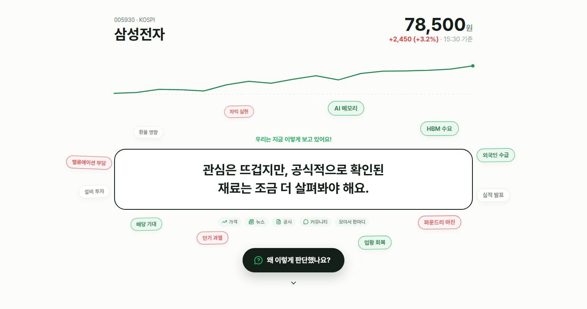
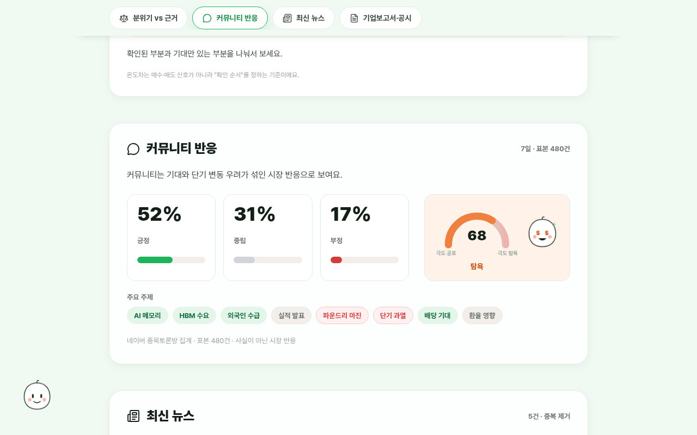
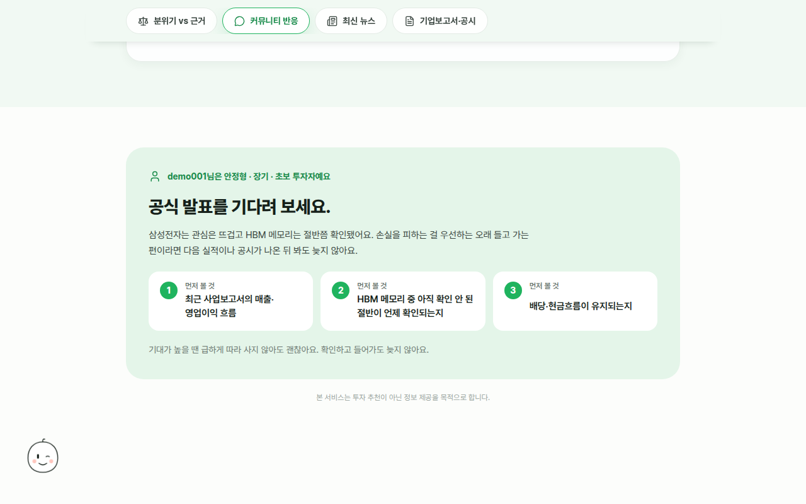
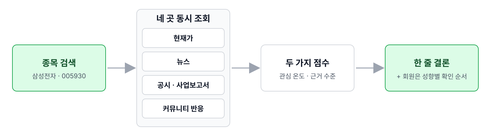
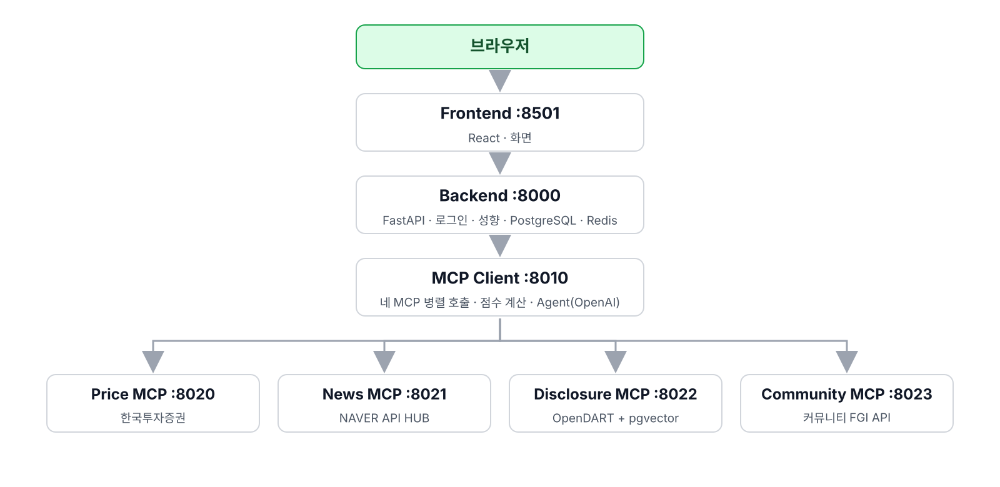

<div align="center">

# 살래? 말래?

### 종목 하나를 검색하면 현재가·뉴스·공시·커뮤니티를 한 번에 읽고, "지금 뭘 확인해야 하는지"를 근거와 함께 말해 주는 주식 정보 도우미

엔코아 AI 오케스트레이션 1기 · 2차 프로젝트 · 5팀

[바로 실행](#1-바로-실행-docker) · [어떻게 동작하나](#2-어떻게-동작하나) · [문서](#3-문서) · [팀](#4-팀)


</div>

주식 정보를 볼 때 현재가, 기사, 전자공시, 사업보고서, 커뮤니티 반응은 전부 다른 곳에 흩어져 있습니다. `살래? 말래?`는 이 네 곳을 동시에 조회해서 세 가지로 정리합니다.

| 무엇을 보여 주나 | 어떻게 구하나 |
| --- | --- |
| **관심 온도** — 시장이 지금 얼마나 달아올랐나 | 거래량·뉴스 건수·커뮤니티 활동·공포탐욕지수를 규칙으로 계산 |
| **근거 수준** — 그 관심이 공식 자료로 얼마나 확인됐나 | 최근 30일 주요 공시와 현재 이슈를 대조 |
| **한 줄 결론과 확인 순서** — 회원이면 내 투자 성향에 맞춰 | Agent가 수집된 근거만 가지고 설명하고, 성향별로 먼저 볼 항목을 제안 |

종목 추천, 목표주가, 수익률 예측은 하지 않습니다. 지원 종목은 KOSPI 시가총액 상위 20개 보통주입니다.

<table>
  <tr>
    <td width="33%"></td>
    <td width="33%"></td>
    <td width="33%"></td>
  </tr>
  <tr>
    <td align="center"><sub>비회원: 가격과 한 줄 결론</sub></td>
    <td align="center"><sub>회원: 뉴스·공시·커뮤니티 근거</sub></td>
    <td align="center"><sub>회원: 내 성향에 맞춘 확인 순서</sub></td>
  </tr>
</table>

---

## 1. 바로 실행 (Docker)

Docker Desktop(또는 Docker Engine, `docker compose` v2)만 있으면 소스 빌드 없이 컨테이너 9개(서비스 7개 + PostgreSQL + Redis)가 한 번에 뜹니다. **API 키는 저장소에 들어 있지 않으므로 실행하는 사람이 직접 발급받아 채워야 합니다.**

### 1) `.env` 만들기

저장소를 받은 뒤(또는 `compose.release.yml`과 `.env.example` 두 파일만 내려받아도 됩니다) 예제 파일을 복사하고 표의 값을 채웁니다. `.env`는 Git에 올라가지 않습니다.

```bash
# macOS / Linux
cp .env.example .env
```

```powershell
# Windows PowerShell
Copy-Item .env.example .env
```

| `.env` 항목 | 어디서 받나 | 비워 두면 |
| --- | --- | --- |
| `OPENAI_API_KEY` | https://platform.openai.com/api-keys | Agent 설명이 규칙 기반 문장으로 대체되고, 사업보고서 검색이 빠집니다 |
| `KIS_APP_KEY`, `KIS_APP_SECRET` | https://apiportal.koreainvestment.com (KIS Developers 앱 등록) | 현재가는 필수 값이라 **모든 분석이 실패**합니다 |
| `NAVER_NEWS_CLIENT_ID`, `NAVER_NEWS_CLIENT_SECRET` | NAVER Cloud 콘솔의 NAVER API HUB 검색(뉴스) API | 뉴스 근거가 빠집니다 (`NEWS_MOCK=auto`면 예시 기사로 대체) |
| `DART_API_KEY` | https://opendart.fss.or.kr (인증키 신청) | 공시 근거가 빠집니다 |
| `COMMUNITY_API_TOKEN` | 팀 커뮤니티 API 운영자에게 요청 (공개 발급 없음) | 커뮤니티 근거가 빠집니다 (`COMMUNITY_MOCK=auto`면 예시 반응으로 대체) |
| `JWT_SECRET_KEY`, `ADMIN_PASSWORD` | 직접 정하는 값 | 개발용 기본값이 쓰입니다. 외부에 공개하는 서버라면 반드시 바꿉니다 |

나머지 항목(DB 이름·비밀번호, 모델 이름, 포트)은 기본값 그대로 두어도 됩니다.

### 2) 실행

```bash
docker compose -f compose.release.yml pull          # 이미지 내려받기 (처음 한 번, 약 3GB)
docker compose -f compose.release.yml up -d --wait  # 9개 컨테이너 기동, 준비될 때까지 대기
docker compose -f compose.release.yml ps            # 상태 확인
```

`ps`에서 `postgres`·`redis`가 `healthy`, 나머지 7개가 `Up`이면 준비된 것입니다. 첫 실행은 1분 정도 걸립니다.

### 3) 확인

| 화면 | 주소 | 비고 |
| --- | --- | --- |
| 서비스 (검색·분석) | http://localhost:8501/ | 종목명이나 6자리 코드 입력. 로그인하면 회원 화면까지 보입니다 |
| 랜딩 페이지 | http://localhost:8501/intro | 서비스 소개 |
| 관리자 실황 페이지 | http://localhost:8501/api/v1/admin/live-status | Basic Auth: `.env`의 `ADMIN_USERNAME` / `ADMIN_PASSWORD` (기본 admin / change-me) |

데모 로그인은 `demo001`~`demo010`, 비밀번호는 `Demo1234!`입니다. Backend API 문서는 http://localhost:8000/docs 에 있습니다.

### 4) 종료

```bash
docker compose -f compose.release.yml down       # 컨테이너만 내림 (DB 데이터는 볼륨에 남음)
docker compose -f compose.release.yml down -v    # DB·Redis 데이터까지 삭제
```

### 문제가 생기면

| 증상 | 원인 | 조치 |
| --- | --- | --- |
| 분석 결과가 "현재 가격을 확인하지 못했습니다" | 한국투자증권 토큰은 앱 키당 **1분에 1회**만 발급됩니다. 같은 키를 여러 컴퓨터에서 쓰거나 컨테이너를 연달아 재시작하면 첫 요청이 막힙니다 | 1분 뒤 다시 시도 |
| macOS에서 `news_mcp`만 뜨지 않음 (`port 8021 already in use`) | macOS 시스템 서비스(ftp-proxy)가 8021을 쓰고 있습니다 | `.env`에 `NEWS_MCP_PORT=18021` 추가 후 다시 `up` |
| Apple Silicon Mac에서 `pull`·시작이 느림 | 이미지가 `linux/amd64`라 에뮬레이션으로 돕니다 | 정상입니다. 첫 기동만 기다리면 됩니다 |
| 사업보고서 근거가 항상 비어 있음 | 사업보고서는 별도 색인 작업 후에만 검색됩니다 | 필요한 종목만 색인: `docker compose -f compose.release.yml exec disclosure_mcp python scripts/sync_companies.py` 후 `... exec disclosure_mcp python scripts/ingest_annual_reports.py --stock 005930 --years 2025` |
| 포트 충돌 | 다른 프로그램이 8501·8000·8010·8020~8023·5432·6379 중 하나를 쓰고 있습니다 | `compose.release.yml`의 `ports` 왼쪽 숫자를 바꿉니다 |

로그는 `docker compose -f compose.release.yml logs -f backend`처럼 서비스 이름을 붙여 봅니다. 소스에서 직접 빌드하거나 Docker 없이 서비스별로 띄우는 방법은 [개발 환경](docs/operations/DEVELOPMENT.md)에 있습니다.


---

## 2. 어떻게 동작하나

종목 하나를 검색하면 네 곳을 동시에 조회하고, 두 가지 점수를 계산한 뒤, 추천 없는 한 줄 결론을 만듭니다. 회원이면 저장된 투자 성향에 맞춰 먼저 볼 항목의 순서까지 붙습니다.



서비스는 7개로 나뉘어 있고, 화면은 Backend만, Backend는 MCP Client만 부릅니다. 데이터별 MCP 서버 4개는 각자 외부 API 한 곳씩만 담당합니다.



더 자세한 흐름(시퀀스·ERD·Agent 상태)은 [서비스 구조](docs/architecture/SERVICE_OVERVIEW.md)와 [도식 폴더](docs/architecture/diagrams/)에 있습니다.

---

## 3. 문서

| 문서                                                                                | 내용                                                            |
| ----------------------------------------------------------------------------------- | --------------------------------------------------------------- |
| [개발 계획](docs/planning/plan.md)                                                  | 팀원 역할, 작업 범위, 협업 규칙, 일정과 제출 기준               |
| [API 명세서](docs/specs/API명세서.md)                                               | Backend·MCP Client·MCP Tool Endpoint와 요청·응답·오류           |
| [DB 설계서](docs/specs/DB설계서.md)                                                 | Backend DB와 Disclosure DB의 테이블·인덱스·벡터 검색 설계       |
| [화면 설계서](docs/specs/화면설계서.md)                                             | 단일 페이지 상태, 로그인, 공개·회원 화면과 이동 흐름            |
| [최종 아키텍처](docs/architecture/FINAL_ARCHITECTURE.md)                            | 서비스 책임과 확정 연결 구조                                    |
| [에이전트 아키텍처 설계서](docs/architecture/agent-architecture.md)                 | Profile, 노드·분기, State·Trace, Tool 정책, Memory, 성찰·폴백   |
| [에이전트 시험 결과 보고서](docs/reports/agent-test-report.md)                      | 실제 off/on 비교, 검증기 v1→v2 개선 이력, live 환경 7일 부분실패 집계 |
| [Backend 서술 채택 시험](docs/reports/agent-test-result-report_narrative-source.md) | 윤기화 담당 narrative_source 성공·실패 분기 검증                |
| [Agent 상태 흐름도](docs/architecture/diagrams/agent-state-flow.mmd)                | Workflow 기본 수집과 Agent 선택 조회·성찰·종료                  |
| [서비스 연결 계약](docs/specs/CONNECTION_CONTRACT.md)                               | 포트, 시간 제한, 데이터 경계와 공통 표기 규칙                   |
| [세부 계약](docs/specs/contracts/README.md)                                         | Frontend·Backend·분석·MCP Tool·성향·오류 계약 색인              |
| [로컬 실행 체크리스트](docs/operations/LOCAL_RUN_ENV_CHECKLIST.md)                  | MCP 연결과 서비스별 환경변수·점검 명령                          |
| [Frontend 흐름](docs/specs/FRONTEND_FLOW.md)                                        | 검색·로그인·근거·개인화 화면의 기준 흐름                        |

서비스 구조 상세는 [SERVICE_OVERVIEW.md](docs/architecture/SERVICE_OVERVIEW.md), 소스 빌드·개발 실행은 [DEVELOPMENT.md](docs/operations/DEVELOPMENT.md)를 봅니다. 현재 구현과 연결 기준은 위 문서와 실제 코드를 우선합니다.

---

## 4. 팀

| 이름   | 담당                                                                                      |
| ------ | ----------------------------------------------------------------------------------------- |
| 권오현 (팀장) | 전체 기획·아키텍처·계약 문서, MCP Client(Agent Workflow), Price MCP(한국투자증권), 발표자 |
| 문태웅 | 프론트엔드(React) 전체, Community MCP + 커뮤니티(FGI) 데이터 파이프라인, 통합 테스트·운영 |
| 윤기화 | Backend(인증·Memory·async최적화), DB·infra, News MCP, 관리자페이지, MCP Inspector         |
| 김인혜 | Disclosure MCP(OpenDART 수집·사업보고서 RAG·pgvector)                                     |
| 박성엽 | 사용자 관점 검수·피드백(화면 흐름 점검, 문구·설명 검토, 발표 리허설 피드백)               |

---

## 5. 팀별 작성 영역

| 항목              | 내용                                                                                                                                                     |
| ----------------- | -------------------------------------------------------------------------------------------------------------------------------------------------------- |
| 팀명              | 엔코어 AI 오케스트레이션 1기 2차 프로젝트 5팀                                                                                                            |
| 팀원 및 역할      | [개발 계획의 팀 구성·역할](docs/planning/plan.md#1-팀-구성), 위 4절 팀 표                                                                                |
| 프로젝트 기간     | [개발 계획 일정](docs/planning/plan.md#6-일정) 기준 2026-08-31 착수~09-04 통합·문서화, 이후 발표 준비 기간                                               |
| 저장소            | [twlaude/aio-p2-5th-team-stock](https://github.com/twlaude/aio-p2-5th-team-stock)                                                                        |
| 외부 API 및 도구  | 한국투자증권 Open API, NAVER API HUB, OpenDART, 커뮤니티 FGI API, OpenAI Responses·임베딩, FastMCP                                                       |
| 필수 Agent 산출물 | [아키텍처 설계서](docs/architecture/agent-architecture.md), [시험 결과 보고서](docs/reports/agent-test-report.md)                                        |
| 추가 산출물       | API·DB·화면 설계서, 개발 계획, Mermaid 원본과 라이트/다크 SVG, [30케이스 하네스·원본 실측](tests/scenarios/agent_eval/README.md), Backend 서술 채택 시험 |
| 제출 확인 근거    | 문서에 실제 구현·원본 지표·남은 한계를 기록하며, 성찰 브랜치 실측과 live 환경 운영 이력을 구분합니다                                                           |
