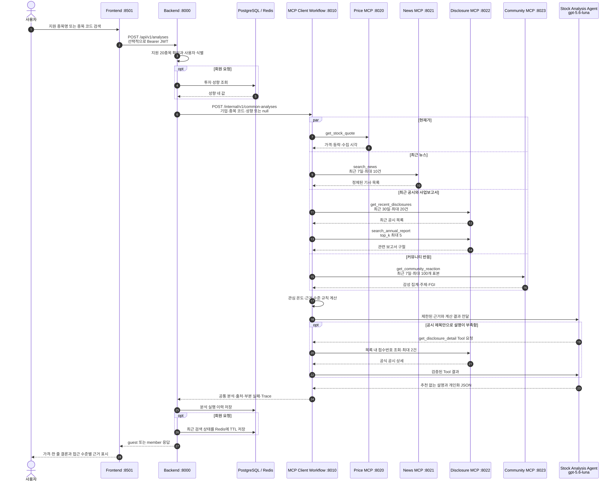

# 살래? 말래?

> 뉴스·전자공시·커뮤니티 반응·현재가를 한 흐름으로 연결해, 지금 확인해야 할 정보를 근거와 함께 설명하는 주식 정보 도우미입니다.

앙코르 AI 오케스트레이션 1기 · 2차 프로젝트 · 5팀

`살래? 말래?`는 종목 추천, 목표주가, 수익률 예측을 제공하지 않습니다. 관심 온도는 시장의 관심 정도를 나타낼 뿐 상승 가능성이나 매수 점수가 아닙니다.

| 대상 | 주소 |
|---|---|
| VPS 데모 | http://159.223.75.71:8501 |
| Price MCP | http://159.223.75.71:8020/mcp |
| News MCP | http://159.223.75.71:8021/mcp |
| Disclosure MCP | http://159.223.75.71:8022/mcp |
| Community MCP | http://159.223.75.71:8023/mcp |

MCP 서버의 상태는 각 포트의 `/health`에서 확인할 수 있습니다. 위 주소는 발표용 공개 데모 범위이며 실제 API Key와 내부 토큰은 공개하지 않습니다.

데모 로그인은 `demo001`부터 `demo010`까지이며 공통 비밀번호는 `Demo1234!`입니다.

---

## 1. 무슨 일을 하는 서비스인가

주식 정보를 확인할 때 현재가, 기사, 전자공시, 사업보고서, 커뮤니티 반응은 서로 다른 곳에 흩어져 있습니다. 사용자는 여러 화면을 오가며 정보의 시점과 출처를 다시 맞춰야 하고, 활발한 반응과 공식 근거를 구분하기도 어렵습니다.

`살래? 말래?`는 지원 종목을 한 번 검색하면 네 종류의 데이터 제공 서버를 함께 조회합니다. 규칙 기반 Workflow가 관심 온도와 근거 수준을 계산하고, 단일 Stock Analysis Agent가 제한된 근거만 사용해 추천 없는 설명을 만듭니다. 회원에게는 저장된 투자 성향에 맞춰 먼저 확인할 항목의 순서도 안내합니다.

### 분석 흐름

<a href="doc/diagrams/service-flow.svg"><picture><source media="(prefers-color-scheme: dark)" srcset="doc/diagrams/service-flow-dark.svg"></picture></a>

| 단계 | 하는 일 |
|---|---|
| ① 종목 검색 | 기업명 또는 6자리 종목 코드를 입력합니다 |
| ② 지원 여부 확인 | Backend가 `shared/supported_companies.json`의 KOSPI 시가총액 상위 20종목인지 먼저 확인합니다 |
| ③ 자료 수집 | MCP Client가 현재가, 최근 뉴스, 최근 공시, 사업보고서, 커뮤니티 반응을 병렬 조회합니다 |
| ④ 규칙 계산 | 가격 변동, 뉴스 언급량, 커뮤니티 활동, FGI, 공시·보고서 유무로 관심 온도와 근거 수준을 계산합니다 |
| ⑤ Agent 설명 | `gpt-5.6-luna`가 수집된 근거를 설명하고, 필요할 때만 최근 공시 상세를 최대 2건 추가 조회합니다 |
| ⑥ 접근 수준 적용 | 비회원은 가격과 한 줄 결론을 보고, 회원은 상세 근거와 성향별 확인 포인트까지 봅니다 |

### 공개 범위

| 사용자 | 제공 내용 |
|---|---|
| 비회원 | 기업명, 현재 가격·등락, 스파크라인, 공통 한 줄 설명 |
| 회원 | 비회원 결과 + 관심 온도 + 근거 수준 + 뉴스·공시·커뮤니티 근거 + 성향별 확인 포인트 |

비회원이 `왜 이렇게 판단했나요?`를 누르면 근거 영역 대신 로그인 게이트가 표시됩니다. 로그인 뒤에는 보던 종목으로 돌아와 회원 분석을 다시 실행합니다.

지원 범위는 `shared/supported_companies.json`에 고정된 2026-09-01 기준 KOSPI 시가총액 상위 20개 보통주 기업입니다. 우선주·ETF·REIT는 제외하며, 범위 밖 종목은 MCP를 호출하지 않고 `unsupported_company`로 안내합니다.

---

## 2. 서비스 구조

Frontend, Backend, MCP Client, 네 MCP 서버를 각각 독립 실행 단위로 분리했습니다. Frontend는 Backend만 호출하고 Backend는 MCP Client 한 곳만 호출합니다. 데이터별 MCP 서버는 서로 직접 호출하지 않으며 사용자 정보도 받지 않습니다.

<a href="doc/diagrams/system-topology.svg"><picture><source media="(prefers-color-scheme: dark)" srcset="doc/diagrams/system-topology-dark.svg"></picture></a>

[시스템 구성도 Mermaid 원본](doc/diagrams/system-topology.mmd)

### 일곱 서비스의 책임

| 서비스 | 포트 | 책임 |
|---|---:|---|
| Frontend | 8501 | 검색, 로그인, 공개 결과, 근거, 개인화 확인 포인트를 표시합니다 |
| Backend | 8000 | 지원 기업, JWT, 투자 성향, Memory, 분석 이력과 접근 수준별 응답을 담당합니다 |
| MCP Client | 8010 | 기본 Tool 병렬 호출, 규칙 계산, Agent 실행, 출처·부분 실패 취합을 담당합니다 |
| Price MCP | 8020 | 한국투자증권 Open API의 현재가를 조회하고 종목별 60초 캐시를 적용합니다 |
| News MCP | 8021 | NAVER API HUB의 최근 뉴스를 정제하고 중복·무관 기사를 제외합니다 |
| Disclosure MCP | 8022 | OpenDART 공시와 사업보고서 RAG를 제공합니다 |
| Community MCP | 8023 | 네이버 종목토론방 기반 반응 집계와 FGI를 정규화합니다 |

### 요청 한 건의 흐름

사용자 요청은 Frontend → Backend → MCP Client 순으로 이동합니다. MCP Client가 기본 Tool 5개를 병렬 호출하고 관심 온도·근거 수준을 계산한 뒤 Agent에 제한된 근거를 전달합니다. 전체 시퀀스와 실제 Tool 이름은 [서비스 흐름도](doc/diagrams/service-flow.mmd)에 정리했습니다.

### Backend 계층

라우터는 HTTP 입력·출력을 처리하고, 서비스는 인증·성향·Memory·분석 조립을 수행합니다. 저장소와 외부 통신은 `repositories/`와 `clients/`로 분리했습니다. Pydantic Schema, Core, PostgreSQL·Redis·MCP Client의 자세한 연결은 [Backend 아키텍처](doc/diagrams/backend-architecture.mmd)에서 확인할 수 있습니다.

<a href="doc/diagrams/backend-architecture.svg"><picture><source media="(prefers-color-scheme: dark)" srcset="doc/diagrams/backend-architecture-dark.svg"></picture></a>

### 설계 의도

| 설계 | 이유 |
|---|---|
| Frontend의 단일 진입점 | 브라우저에 MCP 주소, DB 주소, 사용자 성향 원본과 비밀값을 노출하지 않습니다 |
| 기본 조회와 Agent 분리 | 필수 자료는 Workflow가 항상 조회해 결과의 재현성을 확보하고, Agent의 Tool 선택 범위는 읽기 전용 공시 상세로 제한합니다 |
| 데이터 MCP 분리 | 제공처별 인증·오류·캐시·정제 규칙을 독립적으로 관리합니다 |
| 공통 분석과 개인화 분리 | 같은 종목의 공통 근거는 유지하고, 회원 성향은 확인 순서와 설명 난이도에만 사용합니다 |
| 부분 성공 유지 | 뉴스·공시·커뮤니티 일부가 실패해도 확인된 결과와 실패 목록을 함께 반환합니다. 단, 현재가는 필수라 실패하면 분석을 중단합니다 |
| 정형·벡터 검색 분리 | 지원 기업과 보고서 범위를 SQL로 먼저 좁힌 뒤 pgvector로 관련 구절만 검색합니다 |
| 출처와 시간 유지 | 확인하지 못한 값을 추측하지 않고, 수집 시각과 공식 URL을 결과에 남깁니다 |

### 기술 스택

| 구분 | 사용 기술 |
|---|---|
| Frontend | React 19, TypeScript, Vite 8, React Router, Motion, Lucide React |
| Backend | Python 3.12, FastAPI, Pydantic v2, PyJWT, psycopg2, Redis |
| MCP Client | FastAPI, FastMCP 4, OpenAI Responses API, `gpt-5.6-luna` |
| MCP 서버 | FastMCP Streamable HTTP, HTTPX |
| 데이터베이스 | PostgreSQL, pgvector, `text-embedding-3-small` 1536차원 |
| 외부 데이터 | 한국투자증권 Open API, NAVER API HUB, OpenDART, 커뮤니티 FGI API |
| 인프라 | Docker, Docker Compose, VPS systemd |
| 테스트 | pytest, Vitest, Playwright Core |

### 폴더 구조

```text
├── frontend/       React 단일 페이지 사용자 화면
├── backend/        공개 API, JWT, 투자 성향, Memory, 개인화 응답
├── mcp_client/     기본 Workflow, 단일 Agent, 네 MCP 통합
├── mcp_servers/    Price · News · Disclosure · Community MCP
├── db/             Backend PostgreSQL 스키마·시드·마이그레이션
├── infra/          PostgreSQL/pgvector · Redis Docker Compose
├── shared/         서비스 연결 계약과 지원 기업 Snapshot
├── tests/          계약·통합·발표 시나리오 테스트
├── docs/           최종 아키텍처·실행·발표와 화면 자료
├── doc/            제출용 명세서와 Mermaid 다이어그램
└── archive/        현재 실행하지 않는 이전 코드
```

### 보안 원칙

- 실제 `.env`, API Key, DB 비밀번호와 내부 토큰은 Git에 올리지 않습니다.
- Frontend에는 Backend 주소 외의 비밀값을 넣지 않습니다.
- 비밀번호는 원문이 아니라 PBKDF2 해시로 저장하고, 로그인은 만료 시간이 있는 HS256 JWT를 사용합니다.
- MCP Client에는 사용자 ID·비밀번호·JWT를 보내지 않으며, 네 MCP 서버에는 투자 성향도 보내지 않습니다.
- Memory에는 인증정보나 API Key를 저장하지 않습니다.
- LLM 입력에는 원본 전체가 아니라 제한된 기사, 보고서 구절, 커뮤니티 집계만 전달합니다.

---

## 3. 빠른 실행

Python 서비스는 의존성 버전이 서로 다를 수 있으므로 서비스별 가상환경을 사용하는 것이 안전합니다. 특히 Disclosure MCP의 OpenAI 패키지 범위와 MCP Client의 고정 버전은 다릅니다.

### 1) PostgreSQL·Redis

```bash
cd infra
cp .env.example .env
docker compose up -d
```

PostgreSQL Volume을 처음 만들 때 `db/schema.sql`과 `db/seed.sql`이 순서대로 적용됩니다. 기존 Volume에는 초기화 SQL이 자동으로 다시 적용되지 않습니다.

### 2) MCP Client

```bash
cd mcp_client
python -m venv .venv
source .venv/bin/activate
python -m pip install -r requirements.txt
cp .env.example .env
python server.py
```

`mcp_client/.env`에는 `OPENAI_API_KEY`와 Price·News·Disclosure·Community MCP URL을 설정합니다. 로컬에서 MCP 4개를 따로 실행하지 않는다면 위 주소 표의 VPS `/mcp` URL을 사용할 수 있습니다.

### 3) Backend

```bash
cd backend
python -m venv .venv
source .venv/bin/activate
python -m pip install -r requirements.txt
cp .env.example .env
uvicorn app.main:app --host 0.0.0.0 --port 8000
```

실제 MCP Client를 호출하려면 `backend/.env`에서 `MCP_CLIENT_MODE=live`, `MCP_CLIENT_URL=http://localhost:8010`을 설정합니다. 배포 환경에서는 `JWT_SECRET_KEY`를 충분히 긴 무작위 값으로 바꿉니다.

### 4) Frontend

```bash
cd frontend
npm ci
cp .env.example .env
npm run dev
```

실제 Backend를 호출하려면 `frontend/.env`에서 `VITE_API_MODE=live`, `VITE_BACKEND_URL=http://localhost:8000`을 설정합니다. 개발 서버는 `http://localhost:8501`에서 열립니다.

### 5) 연결 확인

```bash
curl http://localhost:8010/internal/v1/mcp-status
curl http://localhost:8000/health
curl -X POST http://localhost:8000/api/v1/analyses \
  -H 'Content-Type: application/json' \
  -d '{"query":"삼성전자"}'
```

MCP 4개를 모두 로컬에서 실행하려면 각 폴더의 `.env.example`과 `GUIDE.md`를 확인한 뒤 `python server.py`를 실행합니다. 포트는 Price 8020, News 8021, Disclosure 8022, Community 8023으로 고정합니다.

---

## 4. 팀

| 이름 | 담당 |
|---|---|
| 문태웅 | 프론트엔드(React) 전체, Community MCP + 커뮤니티(FGI) 데이터 파이프라인, VPS 운영·통합 테스트 |
| 권오현 | 전체 기획·아키텍처·계약 문서, MCP Client(Agent Workflow), Price MCP(한국투자증권), 발표자 |
| 윤기화 | Backend(인증·Memory·개인화·분석 API), DB·infra, News MCP |
| 김인혜 | Disclosure MCP(OpenDART 수집·사업보고서 RAG·pgvector) |
| 박성엽 | 사용자 관점 검수·피드백(화면 흐름 점검, 문구·설명 검토, 발표 리허설 피드백) |

---

## 5. 문서

| 문서 | 내용 |
|---|---|
| [개발 계획](doc/plan.md) | 팀원 역할, 작업 범위, 협업 규칙, 일정과 제출 기준 |
| [API 명세서](doc/API명세서.md) | Backend·MCP Client·MCP Tool Endpoint와 요청·응답·오류 |
| [DB 설계서](doc/DB설계서.md) | Backend DB와 Disclosure DB의 테이블·인덱스·벡터 검색 설계 |
| [화면 설계서](doc/화면설계서.md) | 단일 페이지 상태, 로그인, 공개·회원 화면과 이동 흐름 |
| [최종 아키텍처](docs/FINAL_ARCHITECTURE.md) | 서비스 책임과 확정 연결 구조 |
| [서비스 연결 계약](shared/CONNECTION_CONTRACT.md) | 포트, 시간 제한, 데이터 경계와 공통 표기 규칙 |
| [세부 계약](shared/contracts/README.md) | Frontend·Backend·분석·MCP Tool·성향·오류 계약 색인 |
| [로컬 실행 체크리스트](docs/LOCAL_RUN_ENV_CHECKLIST.md) | VPS MCP 연결과 서비스별 환경변수·점검 명령 |
| [Frontend 흐름](docs/FRONTEND_FLOW.md) | 검색·로그인·근거·개인화 화면의 기준 흐름 |

초기 아이디어와 폐기된 구조는 `docs/archive/`에 보관합니다. 현재 구현과 연결 기준은 위 최종 문서와 실제 코드를 우선합니다.
