# 데이터베이스 설계서

- 서비스: **살래? 말래?**
- DBMS: **PostgreSQL + pgvector** 2개 논리 경계, **Redis 7** 단기 상태 저장소 (`infra/docker-compose.yml`의 로컬 이미지는 `pgvector/pgvector:pg16`)
- 관계형 테이블: Backend DB 4개 + Disclosure MCP 전용 DB 4개 = **총 8개**
- 원본: `db/schema.sql`, `db/seed.sql`, `db/migrations/`, `mcp_servers/disclosure_mcp/db/schema.sql`

이 문서는 회원·투자 성향·분석 이력을 보관하는 Backend DB와 OpenDART 공시·정기보고서 RAG를 보관하는 Disclosure MCP 전용 DB의 데이터 구조를 정의합니다. 두 PostgreSQL 영역은 별도 `DATABASE_URL`을 사용하는 독립 경계여서 같은 `stock_code`에도 DB 간 FK가 없습니다. Redis는 회원별 최근 분석 상태용 단기 저장소이므로 ERD의 테이블 수에는 포함하지 않습니다.

---

## 1. 시스템 업무 흐름

<a href="diagrams/db-business-flow.svg"><picture><source media="(prefers-color-scheme: dark)" srcset="diagrams/db-business-flow-dark.svg"></picture></a>

[Mermaid 원본](diagrams/db-business-flow.mmd)

회원가입은 `users`·`user_profiles`를 같은 트랜잭션에서 생성합니다. 분석 결과는 `analysis_runs`, 회원의 최근 검색은 TTL 1,800초 Redis에 저장합니다. Disclosure MCP는 `companies`로 지원 기업을 확인하고 최근 공시는 `disclosures`에 upsert하며, 정기보고서는 `annual_reports` SQL 선필터 뒤 해당 `report_chunks.embedding`의 cosine distance top-k를 반환합니다.

---

## 2. 저장소 경계와 책임

| 저장소 | 소유 서비스 | 실제 저장 대상 | 영속성·연결 기준 |
|---|---|---|---|
| Backend PostgreSQL | Backend | 회원, 장기 투자 성향, 분석 결과 스냅샷, 공용 RAG 청크 스키마 | `backend/app/core/config.py`의 `DATABASE_URL`; 기본 DB명 `stock_insight` |
| Disclosure PostgreSQL | Disclosure MCP | 지원 기업과 DART 기업코드, 최근 공시 캐시, 정기보고서 메타데이터·벡터 청크 | Disclosure MCP 프로세스의 별도 `DATABASE_URL`; DB명은 배포 환경에서 지정 |
| Redis DB 0 | Backend | 회원별 최근 검색 종목명·종목코드·검색 시각 | `REDIS_URL`; 키 TTL 기본 1,800초 |

### 2.1 정형 데이터와 벡터 데이터 분리

| 구분 | 테이블 | 저장 내용 | 조회 방식 |
|---|---|---|---|
| 정형 | `users`, `user_profiles`, `analysis_runs` | 인증 식별자, 허용값이 정해진 투자 성향, 분석 상태·시각·결과 | PK·UNIQUE·FK·복합 B-tree 인덱스 |
| 공용 벡터 스키마 | `rag_chunks` | 뉴스·공시·커뮤니티·보고서의 긴 텍스트와 1,536차원 벡터 | `stock_code`, `doc_type` SQL 선필터 후 벡터 검색을 의도한 DDL |
| Disclosure 정형 | `companies`, `disclosures`, `annual_reports` | 기업 식별자, 공시 목록 캐시, 보고서 종류·연도·원문 메타데이터 | 종목·기간·보고서 종류 선필터 |
| Disclosure 벡터 | `report_chunks` | 보고서 섹션 본문, 표 포함 여부, 해시, 1,536차원 벡터 | `annual_report_id` SQL 선필터 후 cosine distance top-k |

`rag_chunks`는 공용 벡터 저장소로 DDL에 선언되어 있지만, 현재 Backend에는 이 테이블을 직접 적재하거나 검색하는 저장소 코드가 없습니다. 현재 동작이 코드로 확인되는 RAG 경로는 Disclosure MCP의 `annual_reports`·`report_chunks`입니다. 문서는 선언된 스키마와 실제 사용 경로를 구분하여 기록합니다.

### 2.2 Redis 키 계약

| 항목 | 현재 구현 |
|---|---|
| 키 형식 | `backend:short_term:{user_id}` |
| 값 형식 | JSON 문자열 |
| 저장 필드 | `recent_company_name`, `recent_stock_code`, `searched_at` |
| 쓰기 시점 | 로그인 회원의 분석 응답을 완성한 뒤 |
| TTL | `REDIS_TTL_SECONDS`, 기본 1,800초 |
| 삭제 | Memory 삭제 시 투자 성향 행과 함께 해당 Redis 키 삭제 |
| 장애 시 보존 범위 | Redis 값은 단기 상태이므로 사라져도 `users`, `user_profiles`, `analysis_runs`는 PostgreSQL에 남음 |

현재 Redis 코드는 완성된 분석 응답 전체를 캐시하지 않습니다. 회원별 최근 검색 상태를 기존 JSON에 병합하고 TTL을 갱신하는 용도로 사용합니다.

---

## 3. 논리 ERD

논리 ERD는 SQL 타입과 인덱스를 제외하고 업무 엔티티의 의미와 관계를 표현합니다. Backend DB와 Disclosure DB 사이에는 물리 FK가 없으므로 두 영역을 관계선 없이 나눕니다. `근거 청크`의 종목 코드는 논리적으로 기업을 식별하지만 현재 서로 다른 DB 경계이며 FK로 강제하지 않습니다.

<a href="diagrams/logical-erd.svg"><picture><source media="(prefers-color-scheme: dark)" srcset="diagrams/logical-erd-dark.svg"></picture></a>

[Mermaid 원본](diagrams/logical-erd.mmd)

### 3.1 업무별 카디널리티

| 부모·주체 | 자식·대상 | 카디널리티 | 업무 의미 | 실제 강제 규칙 |
|---|---|---:|---|---|
| 회원 | 투자 성향 | 1:0..1 | 회원별 장기 투자 성향입니다 | `user_profiles.user_id`가 PK이자 FK이며 회원 삭제 시 CASCADE입니다 |
| 회원 | 분석 실행 | 1:0..N | 회원이 여러 분석을 실행할 수 있습니다 | 비회원 분석은 `analysis_runs.user_id IS NULL`입니다 |
| 지원 기업 | 공시 캐시 | 1:0..N | 기업별 최근 공시 목록을 저장합니다 | `disclosures.stock_code` NOT NULL FK입니다 |
| 지원 기업 | 정기보고서 | 1:0..N | 기업별 사업·반기·분기보고서를 보관합니다 | `annual_reports.stock_code` NOT NULL FK입니다 |
| 정기보고서 | 보고서 청크 | 1:0..N | 한 보고서를 검색 가능한 여러 섹션으로 나눕니다 | `report_chunks.annual_report_id` NOT NULL FK, 보고서 삭제 시 CASCADE입니다 |

`rag_chunks`는 `stock_code`를 문자열로 저장하며 Backend DB 안에 종목 마스터 FK가 없습니다. 지원 기업의 공통 원본은 `shared/supported_companies.json`이고, Disclosure DB의 `companies`는 동기화 스크립트가 이 목록과 OpenDART `corp_code`를 결합해 채웁니다.

---

## 4. 물리 ERD

물리 ERD는 `db/schema.sql`과 `mcp_servers/disclosure_mcp/db/schema.sql`에 선언된 실제 8개 테이블과 키를 나타냅니다. 도식은 모든 컬럼을 포함하며, 복합 UNIQUE·CHECK·기본값의 상세는 5장에 정의합니다.

<a href="diagrams/physical-erd.svg"><picture><source media="(prefers-color-scheme: dark)" srcset="diagrams/physical-erd-dark.svg"></picture></a>

[Mermaid 원본](diagrams/physical-erd.mmd)

`rag_chunks`와 Disclosure DB의 `companies` 사이에는 FK가 없고 Redis는 관계형 테이블이 아니므로 물리 ERD에서 제외합니다.

---

## 5. Backend DB 테이블 상세

### 5.1 `users` — 회원

| 컬럼 | 타입 | NULL | 기본값·제약 | 설명 |
|---|---|---|---|---|
| `user_id` | text | N | **PK** | Backend가 발급하는 문자열 회원 식별자 |
| `username` | text | N | **UNIQUE** | 로그인 사용자명 |
| `password_hash` | text | N | | PBKDF2-SHA256 결과. 평문 비밀번호는 저장하지 않음 |
| `display_name` | text | N | | 화면 표시 이름 |
| `created_at` | timestamptz | N | `now()` | 가입 시각 |

### 5.2 `user_profiles` — 장기 투자 성향

| 컬럼 | 타입 | NULL | 기본값·제약 | 설명 |
|---|---|---|---|---|
| `user_id` | text | N | **PK, FK → `users.user_id`**, ON DELETE CASCADE | 회원별 최대 한 행 |
| `experience_level` | text | N | CHECK: `beginner`, `intermediate`, `experienced` | 투자 경험 수준 |
| `risk_profile` | text | N | CHECK: `conservative`, `balanced`, `aggressive` | 위험 성향 |
| `investment_horizon` | text | N | CHECK: `short`, `medium`, `long` | 투자 기간 |
| `preferred_evidence` | text | N | CHECK: `market`, `news`, `financial`, `risk` | 우선 확인할 근거 종류 |
| `updated_at` | timestamptz | N | `now()` | 마지막 변경 시각 |

### 5.3 `analysis_runs` — 분석 결과 스냅샷

| 컬럼 | 타입 | NULL | 기본값·제약 | 설명 |
|---|---|---|---|---|
| `id` | bigserial | N | **PK** | 내부 순번 |
| `request_id` | text | N | **UNIQUE** | 분석 요청 식별자, 중복 저장 방지 기준 |
| `user_id` | text | Y | **FK → `users.user_id`** | 비회원 분석은 NULL |
| `company_name` | text | N | | 분석 기업명 스냅샷 |
| `stock_code` | text | N | | 6자리 종목코드로 사용하지만 DDL CHECK는 없음 |
| `access_level` | text | N | CHECK: `guest`, `member` | 응답 공개 범위 |
| `status` | text | N | | MCP 분석 결과 상태 |
| `one_line_summary` | text | N | | 사용자에게 반환한 한 줄 결론 |
| `sources` | jsonb | N | `'[]'` | 사용한 출처의 가변 구조 |
| `partial_failures` | jsonb | N | `'[]'` | 일부 MCP 실패 목록 |
| `personalized_checkpoints` | jsonb | Y | | 회원용 개인화 확인 포인트 |
| `requested_at` | timestamptz | N | | 분석 요청 시각 |
| `collected_at` | timestamptz | Y | | 근거 수집 완료 시각 |

### 5.4 `rag_chunks` — 공용 RAG 근거 청크

| 컬럼 | 타입 | NULL | 기본값·제약 | 설명 |
|---|---|---|---|---|
| `id` | bigserial | N | **PK** | 청크 식별자 |
| `stock_code` | text | N | | SQL 선필터용 종목코드 |
| `doc_type` | text | N | | 주석상 `news`, `disclosure`, `community_summary`, `report` |
| `document_id` | text | Y | | 기사 URL·공시 접수번호 등 원문 식별자 |
| `chunk_index` | integer | N | `0` | 원문 안의 청크 순서 |
| `title` | text | Y | | 원문 제목 |
| `content` | text | N | | 임베딩 대상 본문 |
| `content_hash` | text | N | `UNIQUE(doc_type, content_hash)` | 중복 적재·재임베딩 방지 해시 |
| `published_at` | timestamptz | Y | | 원문 발행 시각 |
| `ingested_at` | timestamptz | N | `now()` | 시스템 적재 시각 |
| `source` | text | Y | | 원문 제공처 |
| `embedding` | vector(1536) | Y | | 본문 임베딩. DDL상 NULL 허용 |
| `embedding_model` | text | N | `'text-embedding-3-small'` | 임베딩 모델 이름 |
| `metadata` | jsonb | N | `'{}'` | 문서 종류별 부가 정보 |

---

## 6. Disclosure MCP 전용 DB 테이블 상세

### 6.1 `companies` — 지원 기업·OpenDART 식별자

| 컬럼 | 타입 | NULL | 기본값·제약 | 설명 |
|---|---|---|---|---|
| `stock_code` | varchar(6) | N | **PK**, 6자리 숫자 CHECK | 종목코드 |
| `company_name` | text | N | | 기업명 |
| `corp_code` | varchar(8) | N | **UNIQUE**, 8자리 숫자 CHECK | OpenDART 고유번호 |
| `market` | text | Y | | 시장 구분 |
| `is_supported` | boolean | N | `TRUE` | MCP 지원 여부 |
| `created_at` | timestamptz | N | `now()` | 최초 등록 시각 |
| `updated_at` | timestamptz | N | `now()` | 마지막 동기화 시각 |

### 6.2 `disclosures` — 최근 공시 목록 캐시

| 컬럼 | 타입 | NULL | 기본값·제약 | 설명 |
|---|---|---|---|---|
| `receipt_number` | varchar(14) | N | **PK**, 14자리 숫자 CHECK | OpenDART 접수번호 |
| `stock_code` | varchar(6) | N | **FK → `companies.stock_code`** | 공시 기업 |
| `report_name` | text | N | | 공시 보고서명 |
| `published_at` | timestamptz | Y | | 공시 시각 |
| `filed_at` | date | Y | | 공시 접수일 |
| `category` | text | Y | | 현재 서비스 분류: `periodic`, `major`, `other` |
| `is_major` | boolean | N | `FALSE` | 중요 공시 키워드 포함 여부 |
| `is_correction` | boolean | N | `FALSE` | 보고서명에 정정 포함 여부 |
| `source_url` | text | N | | DART 원문 URL |
| `raw_payload` | jsonb | N | `'{}'` | OpenDART 목록 원본 행 |
| `collected_at` | timestamptz | N | `now()` | 마지막 목록 수집 시각 |
| `updated_at` | timestamptz | N | `now()` | 마지막 upsert 시각 |

### 6.3 `annual_reports` — 정기보고서 메타데이터

| 컬럼 | 타입 | NULL | 기본값·제약 | 설명 |
|---|---|---|---|---|
| `id` | bigserial | N | **PK** | 보고서 식별자 |
| `stock_code` | varchar(6) | N | **FK → `companies.stock_code`** | 보고 기업 |
| `report_year` | smallint | N | CHECK: 2000~2100 | 보고 연도 |
| `report_type` | text | N | `'annual'`, CHECK: `annual`, `semi_annual`, `quarterly` | 사업·반기·분기보고서 구분 |
| `report_name` | text | N | | DART 보고서명 |
| `receipt_number` | varchar(14) | N | **UNIQUE**, 14자리 숫자 CHECK | 선택된 최신 정정본 접수번호 |
| `published_at` | timestamptz | Y | | 공시 시각 |
| `source_url` | text | N | | DART 원문 URL |
| `chunk_count` | integer | N | `0`, 0 이상 CHECK | 생성된 청크 수 |
| `content_hash` | char(64) | Y | | 모든 청크 본문을 합친 SHA-256 |
| `indexed_at` | timestamptz | N | `now()` | 최초 색인 시각 |
| `updated_at` | timestamptz | N | `now()` | 갱신 시각 |

### 6.4 `report_chunks` — 정기보고서 벡터 청크

| 컬럼 | 타입 | NULL | 기본값·제약 | 설명 |
|---|---|---|---|---|
| `id` | bigserial | N | **PK** | 청크 식별자 |
| `annual_report_id` | bigint | N | **FK → `annual_reports.id`**, ON DELETE CASCADE | 소속 보고서 |
| `chunk_index` | integer | N | 0 이상 CHECK | 보고서 안의 순서 |
| `section_title` | text | N | | 섹션 제목 |
| `content` | text | N | 공백 제거 후 길이 1 이상 CHECK | 평탄화된 표를 포함할 수 있는 본문 |
| `content_hash` | char(64) | N | | 청크 본문 SHA-256 |
| `has_table` | boolean | N | `FALSE` | 원문 섹션의 표 포함 여부 |
| `embedding` | vector(1536) | N | | 본문 임베딩 |
| `embedding_model` | text | N | `'text-embedding-3-small'` | 색인에 사용한 모델 |
| `metadata` | jsonb | N | `'{}'` | 부가 정보 |
| `created_at` | timestamptz | N | `now()` | 청크 생성 시각 |

---

## 7. 인덱스

### 7.1 Backend DB

| 인덱스·제약 인덱스 | 대상 컬럼 | 목적 |
|---|---|---|
| PRIMARY KEY 제약 | `users.user_id` | 회원 PK 조회 |
| UNIQUE 제약 | `users.username` | 로그인 사용자명 중복 방지·조회 |
| PRIMARY KEY 제약 | `user_profiles.user_id` | 회원별 투자 성향 0..1 보장 |
| UNIQUE 제약 | `analysis_runs.request_id` | 분석 결과 멱등 저장 |
| `idx_analysis_runs_user` | `user_id, requested_at DESC` | 회원별 최근 분석 이력 |
| `idx_analysis_runs_stock` | `stock_code, requested_at DESC` | 종목별 최근 분석 이력 |
| UNIQUE 제약 | `rag_chunks(doc_type, content_hash)` | 같은 문서 종류 안의 중복 청크 방지 |
| `idx_rag_chunks_filter` | `stock_code, doc_type` | 벡터 검색 전 종목·문서 종류 선필터 |

### 7.2 Disclosure MCP DB

| 인덱스·제약 인덱스 | 대상 컬럼 | 목적 |
|---|---|---|
| PRIMARY KEY / UNIQUE 제약 | `companies.stock_code` / `companies.corp_code` | 종목코드 PK와 DART 고유번호 중복 방지 |
| `idx_companies_name` | `company_name` | 기업명 조회 보조 |
| PRIMARY KEY 제약 | `disclosures.receipt_number` | 공시 접수번호 기준 upsert·상세 메타 조회 |
| `idx_disclosures_stock_published` | `stock_code, published_at DESC` | 기업별 최근 공시 조회 |
| `idx_disclosures_stock_major_published` | `stock_code, is_major, published_at DESC` | 기업별 중요 공시 최신순 조회 |
| UNIQUE 제약 | `annual_reports.receipt_number` | 정정본 접수번호 중복 방지 |
| `annual_reports_stock_code_report_year_report_type_key` | `stock_code, report_year, report_type` | 기업·연도·보고서 종류별 한 행 보장 |
| `idx_annual_reports_stock_year` | `stock_code, report_year DESC` | 기업별 최근 보고연도 탐색 |
| UNIQUE 제약 | `report_chunks(annual_report_id, chunk_index)` | 보고서 안의 청크 순서 중복 방지 |
| UNIQUE 제약 | `report_chunks(annual_report_id, content_hash)` | 보고서 안의 동일 본문 중복 방지 |
| `idx_report_chunks_report` | `annual_report_id, chunk_index` | 보고서 단위 청크 탐색 |

두 벡터 테이블에는 현재 HNSW·IVFFlat 인덱스가 없습니다. 20개 지원 기업 규모에서는 SQL 선필터 뒤 정확한 거리 계산을 사용한다는 DDL 주석과 일치합니다.

---

## 8. SQL 원본과 핵심 발췌

별도 SQL 파일을 만들지 않습니다. 스키마 적용과 시드의 단일 원본은 다음 경로입니다.

| 목적 | 원본 경로 | 적용 방식 |
|---|---|---|
| Backend 스키마 | `db/schema.sql` | `infra/docker-compose.yml`이 PostgreSQL 최초 기동 시 `01_schema.sql`로 마운트 |
| 발표용 계정·성향·분석 예시 | `db/seed.sql` | PostgreSQL 최초 기동 시 `02_seed.sql`로 마운트 |
| 데모 계정 표시명·성향 정렬 | `db/migrations/2026-09-04_align_demo_users.sql` | 기존 DB에 명시적으로 실행하는 트랜잭션 마이그레이션 |
| Disclosure 스키마 | `mcp_servers/disclosure_mcp/db/schema.sql` | `scripts/init_db.py`가 전용 `DATABASE_URL`에 적용 |
| 정기보고서 종류 확장 | `mcp_servers/disclosure_mcp/scripts/migrate_periodic_reports.py` | 기존 `annual_reports`의 제약을 현재 DDL과 맞춤 |

### 8.1 회원과 장기 Memory의 1:1 관계

출처: `db/schema.sql`

```sql
CREATE TABLE IF NOT EXISTS user_profiles (
    user_id TEXT PRIMARY KEY REFERENCES users(user_id) ON DELETE CASCADE,
    experience_level TEXT NOT NULL CHECK (experience_level IN ('beginner', 'intermediate', 'experienced')),
    risk_profile TEXT NOT NULL CHECK (risk_profile IN ('conservative', 'balanced', 'aggressive')),
    investment_horizon TEXT NOT NULL CHECK (investment_horizon IN ('short', 'medium', 'long')),
    preferred_evidence TEXT NOT NULL CHECK (preferred_evidence IN ('market', 'news', 'financial', 'risk')),
    updated_at TIMESTAMPTZ NOT NULL DEFAULT now()
);
```

### 8.2 공용 RAG의 SQL 선필터

출처: `db/schema.sql`

```sql
CREATE TABLE IF NOT EXISTS rag_chunks (
    id BIGSERIAL PRIMARY KEY, stock_code TEXT NOT NULL, doc_type TEXT NOT NULL,
    content TEXT NOT NULL, content_hash TEXT NOT NULL,
    embedding vector(1536), embedding_model TEXT NOT NULL DEFAULT 'text-embedding-3-small',
    UNIQUE (doc_type, content_hash)
);
CREATE INDEX IF NOT EXISTS idx_rag_chunks_filter
    ON rag_chunks (stock_code, doc_type);
```

### 8.3 정기보고서의 실제 top-k 검색

DDL: `mcp_servers/disclosure_mcp/db/schema.sql` / 쿼리: `mcp_servers/disclosure_mcp/app/rag/store.py`

```sql
SELECT section_title, content,
       1 - (embedding <=> %s::vector) AS score
FROM report_chunks
WHERE annual_report_id = %s
ORDER BY embedding <=> %s::vector
LIMIT %s;
```

`annual_report_id`는 앞 단계에서 `annual_reports`를 `stock_code`, `report_type`, 선택 `report_year`로 조회해 얻습니다. 즉 **기업·보고서 종류·연도 SQL 선필터 → 보고서 ID 범위 제한 → 벡터 cosine distance 정렬 → top-k** 순서입니다.

### 8.4 발표용 Seed와 정렬 Migration

출처: `db/seed.sql`, `db/migrations/2026-09-04_align_demo_users.sql`

```sql
INSERT INTO users (user_id, username, password_hash, display_name)
VALUES ('demo-001', 'demo001', '...PBKDF2 hash...', '안정형 장기 초보')
ON CONFLICT (user_id) DO NOTHING;
UPDATE users SET display_name = '안정형 장기 초보' WHERE user_id = 'demo-001';
```

`db/seed.sql`은 `demo001`~`demo010` 회원·성향 각 10건과 삼성전자 분석 예시 1건을 넣습니다. Migration은 10명의 표시명과 성향을 `BEGIN`~`COMMIT` 안에서 정렬합니다. 비밀번호 해시 전체는 문서에 복제하지 않았습니다.

---

## 9. 설계 의도

### 9.1 서비스별 DB 소유권 분리

Backend는 사용자·개인화·분석 결과를, Disclosure MCP는 OpenDART 수집·RAG를 소유하며 각자 `DATABASE_URL`과 스키마 변경을 관리합니다. DB 간 FK 대신 `shared/supported_companies.json`을 공통 종목 원본으로 사용하고 Disclosure MCP가 이를 `companies`에 동기화합니다.

### 9.2 정형 필터와 벡터 검색의 역할 분리

기업·종목코드·보고연도·문서 종류·시각·상태는 정형 컬럼, 긴 문서의 의미 유사도는 `vector(1536)`로 둡니다. SQL로 업무상 가능한 후보를 줄인 뒤 top-k를 계산해 다른 기업·보고서 종류가 섞이는 것을 막습니다.

Disclosure MCP의 현재 구현은 다음 순서를 코드로 강제합니다.

1. `companies.stock_code`와 `is_supported = TRUE`로 지원 기업을 확인합니다.
2. `annual_reports.stock_code`, `report_type`, 선택 `report_year`로 보고서를 한 건 선택합니다.
3. 선택한 `annual_report_id`로 `report_chunks`를 제한합니다.
4. `<=>` cosine distance 오름차순으로 정렬하고 `LIMIT top_k`를 적용합니다.

### 9.3 임베딩 모델 통일

색인 본문과 검색 질의는 OpenAI `text-embedding-3-small`로 통일합니다. 두 DDL은 1,536차원과 같은 기본 모델명을 선언하며 Disclosure 설정은 다른 공급자·모델을 거부합니다. 모델·차원 변경 시 `report_chunks`와 `rag_chunks`를 같은 모델로 전체 재색인해야 합니다.

### 9.4 PostgreSQL 장기 Memory와 Redis 단기 상태

장기 개인화에 필요한 네 값은 CHECK 제약이 있는 `user_profiles`에 보관합니다. 최근 검색 종목과 시각은 없어져도 원본 회원·성향·분석 이력을 훼손하지 않는 단기 정보이므로 Redis에 TTL과 함께 보관합니다. Memory 삭제 API는 두 저장소를 함께 정리하지만 계정과 과거 분석 스냅샷은 유지합니다.

### 9.5 JSONB와 스냅샷

공급자·도구별 가변 값은 `analysis_runs`의 세 JSONB, `disclosures.raw_payload`, 청크 `metadata`에 저장하되 조회 조건은 정형 컬럼으로 둡니다. 기업명·결론·출처와 DART 원본 payload는 실행·수집 당시 값을 재현하는 스냅샷입니다.

### 9.6 중복 방지와 보고서 원자 교체

분석 결과는 `request_id` UNIQUE와 `ON CONFLICT DO NOTHING`으로 같은 요청의 중복 저장을 막습니다. 최근 공시는 `receipt_number` 기준 upsert로 최신 메타데이터를 갱신합니다. 정기보고서는 기업·연도·종류별 기존 행을 삭제하고 새 보고서와 청크를 같은 연결의 트랜잭션에서 삽입하여 정정본의 메타데이터와 청크 집합이 어긋나지 않게 합니다.

---

## 10. 정규화 근거

### 10.1 제1정규형(1NF)

한 행이 한 업무 개체를 나타내며, 보고서의 여러 섹션은 반복 컬럼이 아니라 `report_chunks` 여러 행으로 분리합니다. 가변 payload는 JSONB 문서로 보존하되 관계·검색 조건은 별도 컬럼입니다.

### 10.2 제2정규형(2NF)

각 테이블은 단일 PK를 사용하므로 복합 PK 일부에만 종속되는 속성이 없습니다. 업무상 복합 식별이 필요한 `annual_reports(stock_code, report_year, report_type)`와 청크 중복 방지 조합은 PK가 아니라 UNIQUE 제약으로 둡니다.

### 10.3 제3정규형(3NF)

| 분리 대상 | 실제 테이블 | 방지하는 이상 현상 |
|---|---|---|
| 회원 / 성향 / 분석 | `users`, `user_profiles`, `analysis_runs` | 인증·개인화·실행 스냅샷의 갱신 주기를 분리 |
| 기업 / 공시 / 보고서 | `companies`, `disclosures`, `annual_reports` | 기업 식별정보를 공시·연도별 보고서마다 반복하지 않음 |
| 보고서 / 청크 | `annual_reports`, `report_chunks` | 원문 URL·접수번호가 모든 청크에 반복되는 것을 막음 |

### 10.4 의도적인 비정규화

`analysis_runs` 결과 조각과 `disclosures.raw_payload`는 당시 값을 보존하는 스냅샷이고, `rag_chunks.document_id`·`title`·`source`는 별도 원문 테이블이 없어 청크에 함께 둡니다. 핵심 엔티티는 정규화하되 실행 재현·원본 추적에 필요한 값은 제한적으로 중복합니다.

---

## 11. 논리 ERD와 물리 ERD 일치 여부

| 논리 모델 | 물리 구현 | 판단 | 근거·예외 |
|---|---|---|---|
| 회원·성향·분석 | `users`, `user_profiles`, `analysis_runs` | 일치 | 성향 PK/FK·CASCADE, 분석의 회원 FK NULL 허용을 반영합니다 |
| 공용 근거 청크 | `rag_chunks` | 조건부 일치 | DDL은 있으나 현재 직접 접근하는 Backend 코드가 없습니다 |
| 기업·공시·보고서 | `companies`, `disclosures`, `annual_reports` | 일치 | 공시·보고서가 기업 FK를 가지며 보고서 조합이 UNIQUE입니다 |
| 보고서·청크 | `annual_reports`, `report_chunks` | 일치 | 청크 FK가 NOT NULL이고 보고서 삭제 시 CASCADE입니다 |
| Backend 종목과 Disclosure 기업 | 공통 `stock_code` 값 | 물리 관계 없음 | 독립 DB이며 `shared/supported_companies.json`을 통해 의미를 맞춥니다 |
| 회원 단기 분석 상태 | Redis 키 | ERD 외 구현 | 관계형 테이블이 아니라 JSON 문자열+TTL입니다 |

---

## 12. 설계 검증 체크리스트

- [x] `db/schema.sql`의 4개 테이블과 Disclosure MCP DDL의 4개 테이블을 물리 ERD와 상세 표에 모두 반영했습니다.
- [x] 두 PostgreSQL DB의 소유 서비스와 별도 `DATABASE_URL` 경계를 구분했습니다.
- [x] `users` 1:N `analysis_runs` 관계에서 비회원 분석의 NULL FK를 반영했습니다.
- [x] `users` 1:0..1 `user_profiles` 관계와 ON DELETE CASCADE를 반영했습니다.
- [x] 공시·정기보고서가 `companies.stock_code`를 참조하고 보고서 청크가 ON DELETE CASCADE임을 반영했습니다.
- [x] 모든 실제 컬럼의 타입, NULL, 기본값, UNIQUE, FK, CHECK 제약을 현재 DDL과 대조했습니다.
- [x] Backend 3개와 Disclosure 5개의 명시적 `CREATE INDEX`를 컬럼 순서까지 반영했습니다.
- [x] Redis 키 형식, 실제 세 필드, JSON 값, 기본 TTL 1,800초와 삭제 흐름을 실제 코드로 확인했습니다.
- [x] `text-embedding-3-small`과 `vector(1536)`의 색인·질의 통일 조건을 DDL·설정·클라이언트 코드로 확인했습니다.
- [x] Disclosure 검색의 SQL 선필터 → `annual_report_id` 제한 → cosine distance → top-k 흐름을 실제 쿼리로 확인했습니다.
- [x] `db/seed.sql`의 데모 계정 10개·성향 10개·분석 예시 1건과 현재 마이그레이션 목적을 확인했습니다.
- [ ] `rag_chunks`는 스키마만 선언되어 있고 현재 직접 적재·검색하는 Backend 코드가 없습니다.
- [ ] Redis의 현재 구현은 분석 응답 전체 캐시가 아니라 회원별 최근 검색 상태 캐시입니다.
- [ ] `analysis_runs.status`, `rag_chunks.doc_type`, `disclosures.category`에는 현재 DB CHECK 제약이 없습니다.
- [ ] `analysis_runs.stock_code`와 `rag_chunks.stock_code`는 6자리 형식 CHECK나 종목 마스터 FK가 없습니다.
- [ ] 두 DB 간 공통 `stock_code` 일치는 DB 제약이 아니라 `shared/supported_companies.json` 동기화 규칙에 의존합니다.
- [ ] 벡터 ANN 인덱스는 아직 없습니다. 현재 규모에서는 선필터 후 정확 검색을 사용합니다.

체크되지 않은 항목은 문서 누락이 아니라 현재 DDL 또는 접근 코드가 강제하지 않는 규칙입니다. 제약이나 저장 경로를 추가할 때는 DDL, 마이그레이션, 저장소 코드, 테스트와 이 문서를 함께 갱신해야 합니다.
