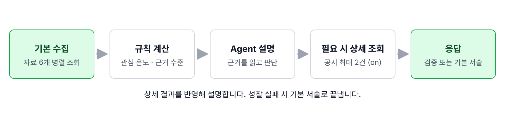

# 에이전트 아키텍처 설계서

**한눈에**
기본 자료는 Workflow(정해진 처리 순서)가 모으고, 점수는 규칙으로 계산합니다.
Agent는 자료를 설명하고 필요할 때 공시 상세를 조회합니다.
성찰(오류 피드백 후 재검증)이 실패하면 폴백(기본 서술)으로 끝냅니다.

기준: 2026-09-07 구현·저장 실측. 배포 상태는 별도입니다.

## 1. 프로젝트 개요

| 항목 | 내용 |
| --- | --- |
| 프로젝트 | 엔코어 AI 오케스트레이션 1기 2차 프로젝트 5팀, 살래? 말래? |
| 목적 | 지원 20종목의 현재가·뉴스·공시·커뮤니티를 모아 현재 관심과 확인 근거를 설명합니다. |
| Agent | `StockAnalysisAgent`, 실행기는 순수 Python `StockAgentRuntime`입니다. |
| 모델 | 코드 설정은 `gpt-5.6-luna`, Responses API, reasoning effort `low`입니다. |
| 출력 | 규칙이 계산한 관심 온도·근거 수준, 모델 또는 폴백 설명, 출처, 실패 목록, 회원 확인 포인트입니다. |
| 범위 | 정보 조회·설명만 수행하며 주문·매매·목표주가·수익률 예측을 제공하지 않습니다. |

기본 Tool(조회 함수) 6개는 고정 병렬 호출합니다(7절). Agent는 `get_disclosure_detail`만 선택합니다. `get_material_disclosures`는 필터를 바꾼 `get_recent_disclosures`의 논리명입니다.

## 2. 설계 범위

MCP Client는 검증·성찰·폴백, Backend는 지원 기업·인증·성향·Memory(사용자 정보 저장)·공개 범위를 맡습니다. Client에는 성향 네 값만 선택 전달하며 사용자 ID·비밀번호·JWT·장기 Memory 원문은 제외합니다.

Agent 간 위임·메시지 교환은 없습니다. 자료 선택·점수는 Python 규칙이 맡습니다. RAG(검색 근거를 활용한 생성)는 사용자 Memory와 별개인 Disclosure MCP 기업보고서 검색입니다.

## 3. 핵심 설계 원칙

| 책임 | 실제 구현 |
| --- | --- |
| 인지 | Backend 지원 기업 확인, `AnalysisRequest`의 필수값·타입 검증 |
| 판단 | 규칙 점수 계산 후 모델이 추가 상세 조회 또는 최종 서술을 선택 |
| 행동 | Runtime이 이름·인자·접수번호를 검증한 후 MCP Client로 조회 |
| 검증 | JSON Schema/Pydantic 및 서술 검증기, 오류 피드백 후 재검증 |
| 종료 | 현재가 필수, 전체 시간·단계·성찰 횟수 제한, 확보된 자료 기반 폴백 |

점수·근거 수준은 모델 출력 Schema(형식 규칙)에서 제외합니다. 실행 권한은 `allowed_tools`·접수번호 `enum`(허용 값 목록)·Runtime이 통제합니다.

## 4. 전체 시스템 구조와 상태 흐름

Frontend(8501) → Backend(기본 8000) → MCP Client(8010) → Price/News/Disclosure/Community MCP(8020~8023). 운영 포트는 실행 폴더 문서를 따릅니다.

60초는 수집·규칙·Agent 제한이며 응답 조립 전체의 SLA(응답시간 보장)가 아닙니다. Schema 성찰에는 응답 ID가 필요합니다. 내부 503/504는 Backend에서 `external_api_error`·공개 HTTP 500으로 바뀝니다. Backend HTTP 대기 timeout은 공개 504입니다(분기: 9절).

## 5. Agent Profile 공통 구조

Profile(역할 정의)은 `app/agents/stock_analysis.py`의 `StockAnalysisAgent` dataclass입니다. 지시문은 `app/prompts/analysis.py`를 참조합니다.

| 필드 | 값 또는 요약 |
| --- | --- |
| `agent_id` | `stock-analysis` |
| `name` | Stock Analysis Agent |
| `goal` | 네 종류의 자료를 비교해 추천 없이 현재 관심 정도와 확인 근거를 설명한다. |
| `description` | 현재가·뉴스·공시·커뮤니티 반응을 근거로 현재 상황을 설명하는 주식 정보 도우미. 추천·목표주가·예측은 하지 않는다. |
| `example_question` | 삼성전자 (Backend는 회사명 또는 6자리 코드 완전일치만 지원) |
| `instructions` | 지시·예측 금지, 계산 결과 유지, 출처 없는 사실 금지, 제한 명시, 성향별 확인 순서 (`ANALYSIS_INSTRUCTIONS`) |
| `allowed_tools` | `frozenset({"get_disclosure_detail"})` |

## 6. Agent별 설계

### 6.1 Stock Analysis Agent

제목만으로 부족하면 공시 상세를 선택 조회합니다. 즉시 서술할 수도 있습니다. 허용 목록이 비면 `tools=[]`, `tool_choice=none`입니다. `Narrative` 필드는 `one_line_summary`, `news_summary`, `disclosure_summary`, `community_summary`, `personalized_checkpoints`입니다.

| 출력 계약 | 강제 Schema | 프롬프트 권고·조건 |
| --- | --- | --- |
| 한 줄 설명 | 240자 | 120자 이내 |
| 세 요약 각각 | 500자 | 2~3문장 |
| 개인화 | `personal_summary`, 1~3개 `priority_checks`, `caution` | 성향이 없으면 null |

## 7. Tool 설계

논리 작업 7개이며 서버 전체 Tool 목록은 아닙니다. 입력: `company_name: str`, `stock_code: str`. MCP 응답은 JSON Object이며 표에는 주요 출력만 적습니다.

| 논리 Tool / 호출 주체 | 실제 입력 | 주요 정상 출력 | 빈 결과·실패 처리 |
| --- | --- | --- | --- |
| `get_stock_quote` / Workflow | 회사 입력 | `current_price`, `change`, `change_rate`, 거래량·`volume_basis`, `as_of` | 비성공은 분석 중단 |
| `search_news` / Workflow | 회사 입력, `lookback_days=7`, `limit=100` | `articles`, `result_count`, `relevant_count`, `span_hours` | 빈 기사 허용, 오류는 실패 목록에 추가 |
| `get_recent_disclosures` / Workflow | 회사 입력, `lookback_days=180`, `limit=20` | `disclosures`의 제목·접수번호·날짜, `collected_at` | 정기공시 기본 조회, `no_data` 허용 |
| `get_material_disclosures` / Workflow | 실제 `get_recent_disclosures`, 회사 입력, `lookback_days=30`, `limit=50`, `disclosure_types=[B,C,D,E,I]` | 주요 공시 목록 | 실패 시 근거 부족 표시, 나머지 자료 유지 |
| `search_annual_report` / Workflow | 회사 입력, 사업·성장·위험·실적 질의, `top_k=5` | `report_year`, `receipt_number`, `matched_passages`, `source_url` | `no_data` 허용, 오류는 실패 목록에 추가 |
| `get_community_reaction` / Workflow | 회사 입력, `lookback_days=7`, `limit=100` | `sample_status`, `sentiment`, `top_topics`, `activity`, `fgi_latest`, 대표 근거 | 소표본·부분 결과 유지, 오류는 실패 목록에 추가 |
| `get_disclosure_detail` / Agent | `receipt_number: str`, 현재 허용 목록의 값 | `receipt_number`, `report_name`, `summary`, 원문 메타데이터 | 오류 결과도 모델에 전달, 같은 번호 재조회 없음 |

`MCPToolClient`의 호출·발견 제한은 15초 `asyncio.timeout`입니다. Client 일괄 재시도는 없습니다. MCP별 내부 재시도(예: Price 제공처)와 성찰은 별개입니다.

| MCP 오류 계약 | 변환 |
| --- | --- |
| `invalid_request`, `unauthorized`, `external_api_error`, `timeout`, `internal_error`, `error`, `unsupported_company` | `MCPClientError` |
| 전송 실패 | `MCP_UNAVAILABLE` |
| 시간 초과 | `MCP_TIMEOUT` |
| 잘못된 JSON Object | `INVALID_MCP_RESPONSE` |

현재가가 있으면 다른 소스 실패에도 부분 성공할 수 있습니다.

## 8. MCP Tool 발견과 Function Calling 실행

`GET /internal/v1/mcp-status`는 네 서버의 `list_tools()`로 연결을 확인합니다. 모델 Schema는 Runtime `_tools()`가 직접 만듭니다.

| 순서 | 입력 → 처리 → 다음 노드 |
| --- | --- |
| 선택 | 축약 컨텍스트 + 접수번호 enum → 모델의 function call 또는 최종 JSON |
| 호출 검증 | `FunctionCall(call_id, name, arguments)` → on은 allowlist·JSON Object·필수 문자열·추가 키·목록·중복·2건 상한 검사 |
| 실행 | 유효한 접수번호 → `DisclosureMCPClient.get_disclosure_detail()` |
| 결과 처리 | 성공 Object 또는 오류 Object → JSON 문자열의 `function_call_output`, 동일 `call_id` 사용 |
| 다음 판단 | 결과를 `next_turn()`에 전달 → 추가 상세 조회 또는 최종 서술 |

off는 이름·JSON·목록·중복만 검사합니다. 추가 키·실행 직전 2건 상한은 강제하지 않고, 2건 조회 뒤 다음 모델 요청에서 Tool을 닫습니다.

| Provider 계약 | 값·동작 |
| --- | --- |
| 공통 | `parallel_tool_calls=False`, strict JSON Schema, `max_output_tokens=1200`, `store=False` |
| on 후속 호출 | 요청별 `ContextVar`의 입력·출력·암호화 reasoning 재전송 |
| off 후속 호출 | `previous_response_id`; [별도 실측](../reports/agent-test-report.md) HTTP 400 |

## 9. 공통 Python Agent Loop

### 9.1 노드와 입력·출력

`app/` 경로는 별도 표기하지 않으면 `mcp_client/app/` 기준입니다.

| 단계·노드 | 실제 파일·함수 | 주요 입력 → 출력 |
| --- | --- | --- |
| 인지: 요청·지원 검증 | `backend/app/services/analysis/companies.py:resolve_company`, `schemas/analysis.py:AnalysisRequest` | query/회사·성향 → 지원 회사 또는 오류 |
| 행동: 병렬 수집 | `services/data_collector/service.py:DataCollector.collect` | CompanyRef → CollectedData·실패·완료 Tool |
| 판단: 규칙 계산 | `services/analysis_builder/scoring.py:calculate_market_temperature`, `calculate_evidence_level` | 수집값 → 온도·근거 수준 |
| 인지: 컨텍스트 구성 | `workflows/analysis.py:_context`, `_receipt_numbers` | 수집값·성향 → context·허용 번호 |
| 판단: 모델 | `providers/openai.py:first_turn`, `next_turn` | context/결과/피드백 → ModelTurn |
| 행동: 선택 조회 | `runtime/agent.py:_call_error`, `_run_reflecting` | FunctionCall → 상세 결과/오류 |
| 검증·성찰 | `providers/openai.py:_normalize`, `runtime/verifier.py:verify_narrative` | 응답·context → Narrative 또는 위반 목록·피드백 |
| 폴백 | `services/analysis_builder/narrative.py:build_fallback_narrative` | 기존 context → 규칙 문장 |
| 응답·개인화 | `workflows/analysis.py:run`, `backend/app/services/analysis/service.py:run_analysis` | AgentResult → 분석 응답·공개 범위·회원 확인 포인트 |

### 9.2 주요 분기와 종료

| 조건 | 실제 처리·종료 |
| --- | --- |
| 미지원 종목 / 잘못된 내부 요청 | Backend 지원 확인에서 중단 / Pydantic 요청 검증 실패, Agent 미실행 |
| 현재가 비성공 | `RequiredPriceError`, 내부 API HTTP 503, LLM 호출 없음 |
| 공시 허용 번호 없음 | Tool Schema 미제공, 설명 생성은 계속 |
| 뉴스·공시·커뮤니티 일부 실패 | 실패 목록을 유지하고 설명 생성, Workflow 완료 시 `partial_completed` 가능 |
| 허용 외 Tool·목록 밖·중복 | off는 `invalid_tool_call`; on은 `tool_selection_error` 피드백 후 예산 내 재실행 |
| 인자 파싱·필수 문자열·추가 키 오류 | on은 `parameter_error`, 잘못된 MCP 호출은 실행하지 않음 |
| Schema 오류 + 응답 ID 있음 | on은 형식 피드백, Tool 닫고 해당 유형 1회 재요청 |
| 서술 검증 위반 | on은 위반 피드백, Tool 닫고 서술 교정 1회 재요청 |
| Schema/서술 재검증 실패, 성찰/단계 예산 소진 | 복구 과정은 `reflection_exhausted`, 기본 서술 반환 |
| 유효한 Tool 요청이 단계 상한 뒤에도 남음 | `max_steps_exceeded`, 기본 서술 반환 |
| 응답 ID 없는 Provider 실패·서술 부재 | `model_error`, 기본 서술 반환 |
| 수집·Agent 실행 60초 초과 | `workflow_failed`, 내부 API HTTP 504 |

`max_agent_steps=3`: 최초 1회 + 후속 최대 3회(성찰 포함). `agent_max_reflections=2`, Schema·서술 교정 각각 1회입니다. 성찰 이벤트 여러 개가 한 피드백 호출에 합쳐질 수 있습니다.

설정 기본은 on, 기존 3인자 Runtime 생성자는 off이며 factory가 설정을 전달합니다. off는 기존 입출력을 유지하고 서술을 검사하지 않습니다. 최종 폴백 재검증·채택 루프는 없습니다.

## 10. Agent State

### 10.1 실행 상태와 공유 객체

영구 단일 State 없이 Workflow 지역 변수·`CollectedData`·context dict·`AgentResult`·응답 Schema에 상태를 나눕니다.

| 필드 | 실제 타입·소유 객체 | 생성·사용 노드 |
| --- | --- | --- |
| `request_id`, `run_id` | `str`, AnalysisRequest/AnalysisResponse·Reporter | Backend 요청 ID, Workflow UUID 생성·이벤트 연결 |
| `status` | 응답 `Literal["success", "partial_success"]`; 이벤트는 별도 문자열 | Workflow 실패 취합·진행 전송; AgentResult 필드 아님 |
| `termination_reason` | `str`, AgentResult/AnalysisResponse | Runtime 종료; Workflow는 완료+실패를 `partial_completed`로 변환 |
| `llm_calls`, `tool_calls` | `int`, AgentResult·TraceSummary | 모델/상세 호출; Trace는 기본 수집도 합산 |
| `input_tokens`, `output_tokens` | `int`, AgentResult | Provider usage 합산; TraceSummary에는 없음 |
| `completed_tools`, `failed_tools` | `list[str]`, CollectedData·AgentResult·TraceSummary | 수집/상세 조회 결과; 완료 목록은 동일 이름이 반복될 수 있음 |
| `failures` | `list[ToolFailure]`, CollectedData·AgentResult | service/status/message/retryable; 응답은 retryable 없는 `partial_failures` |
| `reflections` | `list[ReflectionEvent]`, AgentResult | kind/detail/attempt/resolved; 감지·재검증 때 변경 |
| `reflection_calls` | `int`, AgentResult | 실제 성찰 재호출 수; 응답 `trace_summary.reflections`에 대응 |
| `narrative` | `Narrative`, AgentResult | 초기 폴백 또는 검증 통과 모델 서술 |
| `company`, `investment_profile` | context의 `dict`, `dict` 또는 null | 요청·성향 네 값, 모델 입력 |
| `market_temperature`, `evidence_level`, `data` | context의 `dict[str, Any]` | 규칙 결과·축약 자료, 모델·검증기 입력 |
| `failed_tools`, `partial_failures` | context의 `list[str]`, `list[dict]` | on에서만 Workflow가 추가, 실패 제한 검사 |
| `used`, `ordered`, `pending` | Runtime의 `set[str]`, `list[str]`, `list[ReflectionEvent]` | 번호 중복 차단·enum·해소 대기 오류 |

`llm_calls`: off Runtime은 회수한 turn만 세어 초기 실패가 빠질 수 있습니다. 하네스는 실패 포함 Provider 호출을 셉니다.

### 10.2 승인 Agent 추가 State

조회 전용으로 `pending_approval`·승인 Snapshot·승인 후 재개 API는 없습니다. `run_id`는 분석·Trace(실행 기록) 연결용입니다.

## 11. Trace 설계

| 진행 이벤트 13종 | owner | 발생 위치·의미 |
| --- | --- | --- |
| `workflow_started` | runtime | Workflow 진입 |
| `collection_started` | runtime | 기본 자료 병렬 수집 시작 |
| `tool_started` | mcp | 기본 또는 선택 상세 조회 시작 |
| `tool_completed` | mcp | 기본 수집 정상 반환 |
| `tool_failed` | mcp | 기본 수집 오류 |
| `llm_started` | runtime | Agent 설명 생성 시작 |
| `llm_completed` | runtime | 모델 서술 채택 경로 |
| `llm_failed` | runtime | legacy 초기 Provider 예외 경로 |
| `workflow_completed` | runtime | 응답 조립 완료 |
| `workflow_failed` | runtime | Workflow 시간 초과 |
| `model_selected_tool` | ai_agent | 성찰 on에서 모델이 요청한 function call마다 Tool 이름 기록 |
| `policy_blocked_call` | policy | 성찰 on에서 Tool 선택·인자 오류 차단, message에 오류 kind 기록 |
| `reflection_requested` | policy | 성찰 on에서 스키마·서술 피드백 재호출 직전 |

기존 10종에 on 전용 3종을 더했습니다. on `stop()`은 실패 목록만 반환하고 `llm_failed`를 내지 않습니다. `policy_blocked_call`은 종료와 무관하게, `reflection_requested`는 예산 내 재호출 때만 기록합니다. 상세 조회는 시작 후 완료/실패 이벤트가 없습니다.

| Trace 전달 계약 | 값·동작 |
| --- | --- |
| 필수 payload | `request_id`, `run_id`, `event`, `owner`, `step`, `status`, `message`, `progress_percent`, `occurred_at` |
| 선택 payload | `tool_name`, `service` |
| `ProgressReporter.publish(owner=...)` 생략 | Tool 시작·완료·실패는 `mcp`, Workflow·수집·LLM 등 나머지는 `runtime` |
| Reporter | 메모리 `events` 기록; Backend URL 설정 시 2초 제한 전달, 실패는 경고만 기록 |
| `TraceSummary` | `tool_calls`, `llm_calls`, `completed_tools`, `failed_tools`, `duration_ms`, `reflections` |
| `reflections` | 이벤트 수가 아닌 성찰 재호출 수; 0이면 직렬화 생략 |
| TraceSummary 제외 | 토큰·ReflectionEvent 상세 (보관: 14절) |

## 12. Human Approval 실행 흐름

주문·매매·저장 Tool과 승인 대기·승인·거절은 없습니다. Backend 이력은 내부 기록입니다.

## 13. Tool 위험도 정책

| Tool | 위험도 | change 여부 | 실행 정책 | 코드 근거 |
| --- | --- | --- | --- | --- |
| `get_stock_quote` | read | 없음 | Workflow 고정 호출 | `policy.TOOL_RISK` |
| `search_news` | read | 없음 | Workflow 고정 호출 | `policy.TOOL_RISK` |
| `get_recent_disclosures` | read | 없음 | Workflow 고정 호출 | `policy.TOOL_RISK` |
| `get_material_disclosures` | read | 없음 | Workflow 고정 호출, 공시 필터 지정 | `policy.TOOL_RISK` |
| `search_annual_report` | read | 없음 | Workflow 고정 호출 | `policy.TOOL_RISK` |
| `get_community_reaction` | read | 없음 | Workflow 고정 호출 | `policy.TOOL_RISK` |
| `get_disclosure_detail` | read | 없음 | Agent allowlist·번호 enum·중복 차단·상한 | `policy.TOOL_RISK`, `StockAnalysisAgent.allowed_tools` |
| 현재 변경 Tool 없음 | change | 등록 없음 | 등록되어도 자동 실행 차단 | `policy.CHANGE_TOOLS = frozenset()` |
| `place_order`, `make_payment`, `send_message`, `update_profile` | forbidden | 허용 없음 | allowlist 포함 여부와 무관하게 차단 | `policy.FORBIDDEN_TOOLS` |
| Agent allowlist 밖의 Tool | forbidden | 허용 없음 | 자동 실행 차단 | `policy.action_risk()` |

`mcp_client/app/agents/policy.py`의 `action_risk(tool_name, allowed_tools)`는 금지/allowlist 밖 → `forbidden`, 변경 목록 → `change`, 나머지 → `TOOL_RISK`(미등록 `read`)입니다. `StockAnalysisAgent.tool_risks`는 7개 분류의 독립 사본입니다. 기본 6개는 선택 경로 밖입니다. Runtime은 on/off 모두 `action_risk()`의 `read`만 실행하고 차단 메시지에 위험도를 넣습니다. on은 `tool_selection_error` 피드백, off는 `invalid_tool_call` 종료이며 승인 정책 엔진은 없습니다.

## 14. State 저장·멱등성·Memory

조회 전용으로 변경 Tool 멱등성(반복 실행의 결과 보장)은 해당하지 않습니다. `dict.fromkeys`로 번호 중복을 없애고 `used`로 요청 내 재조회를 막습니다. 요청 간 영구 멱등 키는 없습니다.

컨텍스트: 뉴스·정기공시·주요 공시·보고서 구절 각각 5개. 상세 후보는 매칭 → 주요 → 정기공시 순으로 중복 제거 후 5개이며 on은 최대 2건 조회합니다. 커뮤니티는 집계·주제·대표 근거 등 허용 필드만 보냅니다. 뉴스는 회사명 포함 제목·관련도·최신순을 반영합니다.

`backend/app/services/memory/`의 저장 범위는 다음과 같습니다. 과거 대화 조회·요약·재주입과 토큰 예산별 자동 요약은 없습니다.

| 저장 위치 | 실제 내용·수명 | 근거 |
| --- | --- | --- |
| PostgreSQL `user_profiles` | `experience_level`, `risk_profile`, `investment_horizon`, `preferred_evidence` | `backend/app/repositories/user_repository.py` |
| Redis `backend:short_term:{user_id}` | 회원의 `recent_company_name`, `recent_stock_code`, `searched_at`; 기본 TTL 1800초, 검색 때 갱신 | `backend/app/clients/redis/client.py`, `app/core/config.py` |
| PostgreSQL `analysis_runs` | 요청·사용자·회사·접근수준·status·한 줄 설명·출처·실패·개인화·요청/수집 시각 | `backend/app/repositories/analysis_repository.py:save_run` |
| Redis `backend:live-events` | `short_term`, `analysis_run` Pub/Sub 알림; 영구 이벤트 로그 아님 | Redis client·analysis repository |
| Redis `backend:last_event_at` | 마지막 발행 시각, TTL 없음 | Redis client |
| Provider `ContextVar` | 현재 요청의 입력·출력·후속 호출용 암호화 reasoning | `mcp_client/app/providers/openai.py` |

`backend/app/routers/admin/live_status_page.py`의 HTML+JS는 PG/Redis snapshot·Pub/Sub 두 알림으로 최근 검색·TTL·분석·실패를 표시합니다. Backend는 MCP Client 진행 이벤트 13종을 수신·저장하지 않습니다. SSE는 `short_term`/`analysis_run` 알림입니다.

`analysis_runs` 저장 제외: `run_id`, `termination_reason`, TraceSummary, 토큰, 성찰 상세, 진행 이벤트 전문, 프롬프트·내부 추론·인증 헤더·키. 사용자 ID·개인화는 저장하되 `personalized_checkpoints`는 MCP 원본이며 최종 응답 전체가 아닙니다. 암호화 reasoning은 후속 재전송에만 쓰고 시험 JSONL에서 제외합니다.

성향: `GET/PUT /api/v1/profile`. Memory: `GET/DELETE /api/v1/memories/me`. 삭제 시 성향·Redis 최근 검색을 함께 제거합니다. 최근 검색은 Agent 프롬프트에 넣지 않습니다.

## 15. Backend API

| API | 책임 |
| --- | --- |
| `POST /api/v1/analyses` | query·회원 여부·지원 기업 확인 후 분석 요청 |
| `GET /api/v1/admin/live-status/stream` | 관리자용 Redis 실황 알림 SSE |
| `POST /internal/v1/common-analyses` | MCP Client의 AnalysisRequest → AnalysisResponse |
| `GET /internal/v1/mcp-status` | 네 MCP 연결·Tool 발견 상태 |
| `GET /api/v1/admin/live-status` | 관리자용 최근 실행·집계·연동 상태 |

Frontend는 Backend만 호출합니다. Backend는 `agent_first`·OpenAI 실패 목록에 따라 Agent 서술 또는 규칙 조립을 택합니다([윤기화 담당 시험](../reports/agent-test-result-report_narrative-source.md)).

## 16. 파일별 책임

| 경로 | 책임 |
| --- | --- |
| `mcp_client/app/agents/stock_analysis.py`, `app/prompts/analysis.py` | Profile·지시문 |
| `mcp_client/app/workflows/analysis.py`, `app/workflows/factory.py` | 조립·설정·수집·규칙·Agent 연결 |
| `mcp_client/app/runtime/agent.py`, `app/runtime/verifier.py` | 허용 호출·성찰·종료·서술 규칙 |
| `mcp_client/app/providers/openai.py` | Responses 요청·후속 이력·Schema 정규화 |
| `mcp_client/app/clients/`, `app/services/data_collector/` | MCP 연결·7개 논리 작업·기본 병렬 수집 |
| `mcp_client/app/schemas/analysis.py`, `app/services/progress_reporter.py` | 상태·응답·진행 이벤트 |
| `backend/app/services/analysis/`, `backend/app/clients/redis/` | 서술 채택·개인화·저장·진행 조회 |
| `tests/scenarios/agent_eval/` | 실측 입력·픽스처·관측·집계, 제품 코드와 분리 |

## 17. 테스트 기준과 대표 사례

v2 `on.jsonl` 반복 1입니다. 서술·Trace·원인별 결과는 [시험 보고서](../reports/agent-test-report.md)에 있습니다.

| 실제 입력 | 기대 | 실제 결과 | 판정 |
| --- | --- | --- | --- |
| `normal-01`, 성향 있음 | 모델 설명·개인화 존재 | completed·검증 통과 | PASS |
| `normal-07`, 성향 없음 | 모델 설명·개인화 null | completed·검증 통과 | PASS |
| `empty_disclosures-01` | 목록 없으면 상세 미호출 | completed·상세 호출 0 | PASS |
| `normal-09` | 검증 통과 모델 설명 | 목표주가 표현 교정 후 재검증 실패·reflection_exhausted | FAIL: 모델 채택 기준 |
| `detail_failure-01` | 상세 실패 후 후속 응답 확인 | 자연 선택은 상세 호출 0·completed; 첫 호출 강제 보조 실측은 off 후속 HTTP 400 폴백 / on 실패 안내 서술 채택 | on PASS([v3 보조 실측](../reports/agent-eval-results/context-v3/summary.md)) |
| `price_failure-01` | 현재가 없으면 중단 | RequiredPriceError·LLM 0 | PASS: 중단 기준 |

선택·인자·Schema·서술 오류와 복구 상한은 fake provider 단위시험으로 검사합니다. 실측 미발생 유형은 단위시험 근거만이며 금융 사실 전체의 정확성을 보장하지 않습니다.

## 18. 현재 한계와 운영 확장

| 현재 확인된 한계 | 다음 검증·개선 방향 |
| --- | --- |
| 목표주가 비제시·직접 인용과 제한 동등 표현은 v3(`9dcc628`)에서 구분, 간접 인용·수치 부정문은 보수적으로 위반 | 배포 후 표본으로 오탐 재점검 |
| 자연 실측에서 상세 선택 0회 | 첫 호출 강제 보조 실측으로 경로만 확인, 자연 선택 빈도는 별도 관측 |
| 성찰 on 완료율 55/56, off 56/56 | 완료율과 서술 검증 통과율을 함께 관리 |
| TraceSummary에 토큰·성찰 상세 없음, 일부 종료 이벤트 생략 | 현재 저장 범위를 유지해 보고하고 관측 확장은 별도 검토 |
| off의 후속 요청 HTTP 400 | 기존 기준선 보존, on 이력 재전송 결과와 구분 |
| 운영 배포와 시험 브랜치가 다름 | 배포 뒤 동일 조건 표본을 별도로 검증 |

## 상세

원본 상태 흐름: [Mermaid](diagrams/agent-state-flow.mmd) · [라이트 SVG](diagrams/agent-state-flow.svg) · [다크 SVG](diagrams/agent-state-flow-dark.svg).

관련 문서: [최종 구조](FINAL_ARCHITECTURE.md) · [연결 계약](../specs/CONNECTION_CONTRACT.md) · [분석 계약](../specs/contracts/analysis.md) · [실측 수치와 한계](../reports/agent-test-report.md).
