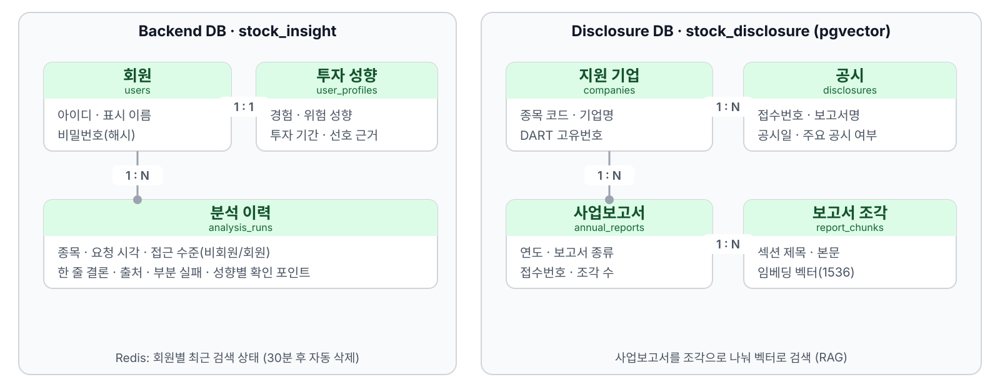

# 데이터베이스 설계서

> **한눈에**
> 회원·성향·분석은 Backend, 공시·보고서 검색은 Disclosure MCP가 맡습니다.
> PostgreSQL은 4개씩 총 8개 테이블, Redis 7은 최근 검색을 보관합니다.
> pgvector(PostgreSQL 벡터 검색 확장)로 보고서에서 뜻이 비슷한 본문을 찾습니다.



**살래? 말래?**의 DB입니다. 두 DB는 별도 `DATABASE_URL`을 쓰며 `stock_code` 간 FK(외래 키)는 없습니다.
`infra/docker-compose.yml`의 로컬 이미지는 `pgvector/pgvector:pg16`입니다. Redis는 ERD(테이블 관계도)의 테이블 수에서 제외합니다.

## 1. 시스템 업무 흐름

가입은 `users`·`user_profiles`를 한 트랜잭션으로 만듭니다. 결과·최근 검색은 2절 기준으로 저장합니다. TTL은 유효 시간입니다.
Disclosure MCP는 `companies` 확인 → `disclosures` upsert(추가·갱신) → `annual_reports` SQL 선필터 → `report_chunks.embedding` cosine distance(코사인 거리) top-k(가까운 k건)로 조회합니다.

## 2. 저장소 경계와 책임

| 저장소 | 소유 서비스 | 실제 저장 대상 | 영속성·연결 기준 |
|---|---|---|---|
| Backend PostgreSQL | Backend | 회원, 장기 투자 성향, 분석 결과 스냅샷, 공용 RAG 청크 스키마 | `backend/app/core/config.py`의 `DATABASE_URL`; 기본 DB명 `stock_insight` |
| Disclosure PostgreSQL | Disclosure MCP | 지원 기업과 DART 기업코드, 최근 공시 캐시, 정기보고서 메타데이터·벡터 청크 | Disclosure MCP 프로세스의 별도 `DATABASE_URL`; DB명은 배포 환경에서 지정 |
| Redis DB 0 | Backend | 회원별 최근 검색 종목명·종목코드·검색 시각 | `REDIS_URL`; 키 TTL 기본 1,800초 |

### 2.1 정형 데이터와 벡터 데이터 분리

| 구분 | 테이블 | 저장 내용 | 조회 방식 |
|---|---|---|---|
| 정형 | `users`, `user_profiles`, `analysis_runs` | 인증 식별자, 허용값이 정해진 투자 성향, 분석 상태·시각·결과 | PK·UNIQUE·FK·복합 B-tree 인덱스 |
| 공용 벡터 스키마 | `rag_chunks` | 뉴스·공시·커뮤니티·보고서의 긴 텍스트와 1,536차원 벡터 | `stock_code`, `doc_type` SQL 선필터 후 벡터 검색을 의도한 DDL |
| Disclosure 정형 | `companies`, `disclosures`, `annual_reports` | 기업 식별자, 공시 목록 캐시, 보고서 종류·연도·원문 메타데이터 | 종목·기간·보고서 종류 선필터 |
| Disclosure 벡터 | `report_chunks` | 보고서 섹션 본문, 표 포함 여부, 해시, 1,536차원 벡터 | `annual_report_id` SQL 선필터 후 cosine distance top-k |

`rag_chunks`는 DDL(테이블 정의)만 있습니다. 실제 RAG(검색을 붙인 생성)는 `annual_reports`·`report_chunks`를 씁니다.

### 2.2 Redis 키 계약

| 항목 | 현재 구현 |
|---|---|
| 키 형식 | `backend:short_term:{user_id}` |
| 값 형식 | JSON 문자열 |
| 저장 필드 | `recent_company_name`, `recent_stock_code`, `searched_at` |
| 쓰기 시점 | 로그인 회원의 분석 응답을 완성한 뒤 |
| TTL | `REDIS_TTL_SECONDS`, 기본 1,800초 |
| 삭제 | Memory 삭제 시 투자 성향 행과 함께 해당 Redis 키 삭제 |
| 장애 시 보존 범위 | Redis 값은 단기 상태이므로 사라져도 `users`, `user_profiles`, `analysis_runs`는 PostgreSQL에 남음 |

Redis는 응답 전체가 아닌 최근 검색을 기존 JSON에 병합하고 TTL을 갱신합니다.

## 3. 논리 ERD

업무 관계만 표현합니다. SQL 타입·인덱스·DB 간 관계선은 생략합니다. `근거 청크`의 기업 FK도 없습니다.

### 3.1 업무별 카디널리티

카디널리티는 연결 행 수입니다.

| 부모·주체 | 자식·대상 | 카디널리티 | 업무 의미 | 실제 강제 규칙 |
|---|---|---:|---|---|
| 회원 | 투자 성향 | 1:0..1 | 회원별 장기 투자 성향입니다 | `user_profiles.user_id`가 PK이자 FK이며 회원 삭제 시 CASCADE입니다 |
| 회원 | 분석 실행 | 1:0..N | 회원이 여러 분석을 실행할 수 있습니다 | 비회원 분석은 `analysis_runs.user_id IS NULL`입니다 |
| 지원 기업 | 공시 캐시 | 1:0..N | 기업별 최근 공시 목록을 저장합니다 | `disclosures.stock_code` NOT NULL FK입니다 |
| 지원 기업 | 정기보고서 | 1:0..N | 기업별 사업·반기·분기보고서를 보관합니다 | `annual_reports.stock_code` NOT NULL FK입니다 |
| 정기보고서 | 보고서 청크 | 1:0..N | 한 보고서를 검색 가능한 여러 섹션으로 나눕니다 | `report_chunks.annual_report_id` NOT NULL FK, 보고서 삭제 시 CASCADE입니다 |

`rag_chunks.stock_code`는 문자열이며 종목 마스터 FK가 없습니다. 동기화 스크립트는 `shared/supported_companies.json`과 OpenDART `corp_code`를 합쳐 `companies`를 채웁니다.

## 4. 물리 ERD

8개 테이블의 모든 컬럼·키를 표현합니다. UNIQUE·CHECK·기본값은 아래 표를 봅니다.

## 상세

## 5. Backend DB 테이블 상세

### 5.1 `users` — 회원

| 컬럼 | 타입 | NULL | 기본값·제약 | 설명 |
|---|---|---|---|---|
| `user_id` | text | N | **PK** | Backend가 발급하는 문자열 회원 식별자 |
| `username` | text | N | **UNIQUE** | 로그인 사용자명 |
| `password_hash` | text | N | | PBKDF2-SHA256 결과. 평문 비밀번호는 저장하지 않음 |
| `display_name` | text | N | | 화면 표시 이름 |
| `created_at` | timestamptz | N | `now()` | 가입 시각 |

### 5.2 `user_profiles` — 장기 투자 성향

| 컬럼 | 타입 | NULL | 기본값·제약 | 설명 |
|---|---|---|---|---|
| `user_id` | text | N | **PK, FK → `users.user_id`**, ON DELETE CASCADE | 회원별 최대 한 행 |
| `experience_level` | text | N | CHECK: `beginner`, `intermediate`, `experienced` | 투자 경험 수준 |
| `risk_profile` | text | N | CHECK: `conservative`, `balanced`, `aggressive` | 위험 성향 |
| `investment_horizon` | text | N | CHECK: `short`, `medium`, `long` | 투자 기간 |
| `preferred_evidence` | text | N | CHECK: `market`, `news`, `financial`, `risk` | 우선 확인할 근거 종류 |
| `updated_at` | timestamptz | N | `now()` | 마지막 변경 시각 |

### 5.3 `analysis_runs` — 분석 결과 스냅샷

| 컬럼 | 타입 | NULL | 기본값·제약 | 설명 |
|---|---|---|---|---|
| `id` | bigserial | N | **PK** | 내부 순번 |
| `request_id` | text | N | **UNIQUE** | 분석 요청 식별자, 중복 저장 방지 기준 |
| `user_id` | text | Y | **FK → `users.user_id`** | 비회원 분석은 NULL |
| `company_name` | text | N | | 분석 기업명 스냅샷 |
| `stock_code` | text | N | | 6자리 종목코드로 사용하지만 DDL CHECK는 없음 |
| `access_level` | text | N | CHECK: `guest`, `member` | 응답 공개 범위 |
| `status` | text | N | | MCP 분석 결과 상태 |
| `one_line_summary` | text | N | | 사용자에게 반환한 한 줄 결론 |
| `sources` | jsonb | N | `'[]'` | 사용한 출처의 가변 구조 |
| `partial_failures` | jsonb | N | `'[]'` | 일부 MCP 실패 목록 |
| `personalized_checkpoints` | jsonb | Y | | 회원용 개인화 확인 포인트 |
| `requested_at` | timestamptz | N | | 분석 요청 시각 |
| `collected_at` | timestamptz | Y | | 근거 수집 완료 시각 |

### 5.4 `rag_chunks` — 공용 RAG 근거 청크

| 컬럼 | 타입 | NULL | 기본값·제약 | 설명 |
|---|---|---|---|---|
| `id` | bigserial | N | **PK** | 청크 식별자 |
| `stock_code` | text | N | | SQL 선필터용 종목코드 |
| `doc_type` | text | N | | 주석상 `news`, `disclosure`, `community_summary`, `report` |
| `document_id` | text | Y | | 기사 URL·공시 접수번호 등 원문 식별자 |
| `chunk_index` | integer | N | `0` | 원문 안의 청크 순서 |
| `title` | text | Y | | 원문 제목 |
| `content` | text | N | | 임베딩 대상 본문 |
| `content_hash` | text | N | `UNIQUE(doc_type, content_hash)` | 중복 적재·재임베딩 방지 해시 |
| `published_at` | timestamptz | Y | | 원문 발행 시각 |
| `ingested_at` | timestamptz | N | `now()` | 시스템 적재 시각 |
| `source` | text | Y | | 원문 제공처 |
| `embedding` | vector(1536) | Y | | 본문 임베딩. DDL상 NULL 허용 |
| `embedding_model` | text | N | `'text-embedding-3-small'` | 임베딩 모델 이름 |
| `metadata` | jsonb | N | `'{}'` | 문서 종류별 부가 정보 |

## 6. Disclosure MCP 전용 DB 테이블 상세

### 6.1 `companies` — 지원 기업·OpenDART 식별자

| 컬럼 | 타입 | NULL | 기본값·제약 | 설명 |
|---|---|---|---|---|
| `stock_code` | varchar(6) | N | **PK**, 6자리 숫자 CHECK | 종목코드 |
| `company_name` | text | N | | 기업명 |
| `corp_code` | varchar(8) | N | **UNIQUE**, 8자리 숫자 CHECK | OpenDART 고유번호 |
| `market` | text | Y | | 시장 구분 |
| `is_supported` | boolean | N | `TRUE` | MCP 지원 여부 |
| `created_at` | timestamptz | N | `now()` | 최초 등록 시각 |
| `updated_at` | timestamptz | N | `now()` | 마지막 동기화 시각 |

### 6.2 `disclosures` — 최근 공시 목록 캐시

| 컬럼 | 타입 | NULL | 기본값·제약 | 설명 |
|---|---|---|---|---|
| `receipt_number` | varchar(14) | N | **PK**, 14자리 숫자 CHECK | OpenDART 접수번호 |
| `stock_code` | varchar(6) | N | **FK → `companies.stock_code`** | 공시 기업 |
| `report_name` | text | N | | 공시 보고서명 |
| `published_at` | timestamptz | Y | | 공시 시각 |
| `filed_at` | date | Y | | 공시 접수일 |
| `category` | text | Y | | 현재 서비스 분류: `periodic`, `major`, `other` |
| `is_major` | boolean | N | `FALSE` | 중요 공시 키워드 포함 여부 |
| `is_correction` | boolean | N | `FALSE` | 보고서명에 정정 포함 여부 |
| `source_url` | text | N | | DART 원문 URL |
| `raw_payload` | jsonb | N | `'{}'` | OpenDART 목록 원본 행 |
| `collected_at` | timestamptz | N | `now()` | 마지막 목록 수집 시각 |
| `updated_at` | timestamptz | N | `now()` | 마지막 upsert 시각 |

### 6.3 `annual_reports` — 정기보고서 메타데이터

| 컬럼 | 타입 | NULL | 기본값·제약 | 설명 |
|---|---|---|---|---|
| `id` | bigserial | N | **PK** | 보고서 식별자 |
| `stock_code` | varchar(6) | N | **FK → `companies.stock_code`** | 보고 기업 |
| `report_year` | smallint | N | CHECK: 2000~2100 | 보고 연도 |
| `report_type` | text | N | `'annual'`, CHECK: `annual`, `semi_annual`, `quarterly` | 사업·반기·분기보고서 구분 |
| `report_name` | text | N | | DART 보고서명 |
| `receipt_number` | varchar(14) | N | **UNIQUE**, 14자리 숫자 CHECK | 선택된 최신 정정본 접수번호 |
| `published_at` | timestamptz | Y | | 공시 시각 |
| `source_url` | text | N | | DART 원문 URL |
| `chunk_count` | integer | N | `0`, 0 이상 CHECK | 생성된 청크 수 |
| `content_hash` | char(64) | Y | | 모든 청크 본문을 합친 SHA-256 |
| `indexed_at` | timestamptz | N | `now()` | 최초 색인 시각 |
| `updated_at` | timestamptz | N | `now()` | 갱신 시각 |

### 6.4 `report_chunks` — 정기보고서 벡터 청크

| 컬럼 | 타입 | NULL | 기본값·제약 | 설명 |
|---|---|---|---|---|
| `id` | bigserial | N | **PK** | 청크 식별자 |
| `annual_report_id` | bigint | N | **FK → `annual_reports.id`**, ON DELETE CASCADE | 소속 보고서 |
| `chunk_index` | integer | N | 0 이상 CHECK | 보고서 안의 순서 |
| `section_title` | text | N | | 섹션 제목 |
| `content` | text | N | 공백 제거 후 길이 1 이상 CHECK | 평탄화된 표를 포함할 수 있는 본문 |
| `content_hash` | char(64) | N | | 청크 본문 SHA-256 |
| `has_table` | boolean | N | `FALSE` | 원문 섹션의 표 포함 여부 |
| `embedding` | vector(1536) | N | | 본문 임베딩 |
| `embedding_model` | text | N | `'text-embedding-3-small'` | 색인에 사용한 모델 |
| `metadata` | jsonb | N | `'{}'` | 부가 정보 |
| `created_at` | timestamptz | N | `now()` | 청크 생성 시각 |

## 7. 인덱스

### 7.1 Backend DB

| 인덱스·제약 인덱스 | 대상 컬럼 | 목적 |
|---|---|---|
| PRIMARY KEY 제약 | `users.user_id` | 회원 PK 조회 |
| UNIQUE 제약 | `users.username` | 로그인 사용자명 중복 방지·조회 |
| PRIMARY KEY 제약 | `user_profiles.user_id` | 회원별 투자 성향 0..1 보장 |
| UNIQUE 제약 | `analysis_runs.request_id` | 분석 결과 멱등 저장 |
| `idx_analysis_runs_user` | `user_id, requested_at DESC` | 회원별 최근 분석 이력 |
| `idx_analysis_runs_stock` | `stock_code, requested_at DESC` | 종목별 최근 분석 이력 |
| UNIQUE 제약 | `rag_chunks(doc_type, content_hash)` | 같은 문서 종류 안의 중복 청크 방지 |
| `idx_rag_chunks_filter` | `stock_code, doc_type` | 벡터 검색 전 종목·문서 종류 선필터 |

### 7.2 Disclosure MCP DB

| 인덱스·제약 인덱스 | 대상 컬럼 | 목적 |
|---|---|---|
| PRIMARY KEY / UNIQUE 제약 | `companies.stock_code` / `companies.corp_code` | 종목코드 PK와 DART 고유번호 중복 방지 |
| `idx_companies_name` | `company_name` | 기업명 조회 보조 |
| PRIMARY KEY 제약 | `disclosures.receipt_number` | 공시 접수번호 기준 upsert·상세 메타 조회 |
| `idx_disclosures_stock_published` | `stock_code, published_at DESC` | 기업별 최근 공시 조회 |
| `idx_disclosures_stock_major_published` | `stock_code, is_major, published_at DESC` | 기업별 중요 공시 최신순 조회 |
| UNIQUE 제약 | `annual_reports.receipt_number` | 정정본 접수번호 중복 방지 |
| `annual_reports_stock_code_report_year_report_type_key` | `stock_code, report_year, report_type` | 기업·연도·보고서 종류별 한 행 보장 |
| `idx_annual_reports_stock_year` | `stock_code, report_year DESC` | 기업별 최근 보고연도 탐색 |
| UNIQUE 제약 | `report_chunks(annual_report_id, chunk_index)` | 보고서 안의 청크 순서 중복 방지 |
| UNIQUE 제약 | `report_chunks(annual_report_id, content_hash)` | 보고서 안의 동일 본문 중복 방지 |
| `idx_report_chunks_report` | `annual_report_id, chunk_index` | 보고서 단위 청크 탐색 |

HNSW·IVFFlat 인덱스는 없습니다. DDL 주석대로 20개 기업은 선필터 후 정확 검색합니다.

## 8. SQL 원본과 핵심 발췌

스키마·시드 원본과 `db/migrations/` 적용 기준입니다.

| 목적 | 원본 경로 | 적용 방식 |
|---|---|---|
| Backend 스키마 | `db/schema.sql` | `infra/docker-compose.yml`이 PostgreSQL 최초 기동 시 `01_schema.sql`로 마운트 |
| 발표용 계정·성향·분석 예시 | `db/seed.sql` | PostgreSQL 최초 기동 시 `02_seed.sql`로 마운트 |
| 데모 계정 표시명·성향 정렬 | `db/migrations/2026-09-04_align_demo_users.sql` | 기존 DB에 명시적으로 실행하는 트랜잭션 마이그레이션 |
| Disclosure 스키마 | `mcp_servers/disclosure_mcp/db/schema.sql` | `scripts/init_db.py`가 전용 `DATABASE_URL`에 적용 |
| 정기보고서 종류 확장 | `mcp_servers/disclosure_mcp/scripts/migrate_periodic_reports.py` | 기존 `annual_reports`의 제약을 현재 DDL과 맞춤 |

### 8.1 회원과 장기 Memory의 1:1 관계

출처: `db/schema.sql`

```sql
CREATE TABLE IF NOT EXISTS user_profiles (
    user_id TEXT PRIMARY KEY REFERENCES users(user_id) ON DELETE CASCADE,
    experience_level TEXT NOT NULL CHECK (experience_level IN ('beginner', 'intermediate', 'experienced')),
    risk_profile TEXT NOT NULL CHECK (risk_profile IN ('conservative', 'balanced', 'aggressive')),
    investment_horizon TEXT NOT NULL CHECK (investment_horizon IN ('short', 'medium', 'long')),
    preferred_evidence TEXT NOT NULL CHECK (preferred_evidence IN ('market', 'news', 'financial', 'risk')),
    updated_at TIMESTAMPTZ NOT NULL DEFAULT now()
);
```

### 8.2 공용 RAG의 SQL 선필터

출처: `db/schema.sql`

```sql
CREATE TABLE IF NOT EXISTS rag_chunks (
    id BIGSERIAL PRIMARY KEY, stock_code TEXT NOT NULL, doc_type TEXT NOT NULL,
    content TEXT NOT NULL, content_hash TEXT NOT NULL,
    embedding vector(1536), embedding_model TEXT NOT NULL DEFAULT 'text-embedding-3-small',
    UNIQUE (doc_type, content_hash)
);
CREATE INDEX IF NOT EXISTS idx_rag_chunks_filter
    ON rag_chunks (stock_code, doc_type);
```

### 8.3 정기보고서의 실제 top-k 검색

DDL: `mcp_servers/disclosure_mcp/db/schema.sql` / 쿼리: `mcp_servers/disclosure_mcp/app/rag/store.py`

```sql
SELECT section_title, content,
       1 - (embedding <=> %s::vector) AS score
FROM report_chunks
WHERE annual_report_id = %s
ORDER BY embedding <=> %s::vector
LIMIT %s;
```

`annual_reports`를 `stock_code`, `report_type`, 선택 `report_year`로 선필터한 뒤 `annual_report_id` 범위에서 거리순 top-k를 구합니다.

### 8.4 발표용 Seed와 정렬 Migration

출처: `db/seed.sql`, `db/migrations/2026-09-04_align_demo_users.sql`

```sql
INSERT INTO users (user_id, username, password_hash, display_name)
VALUES ('demo-001', 'demo001', '...PBKDF2 hash...', '안정형 장기 초보')
ON CONFLICT (user_id) DO NOTHING;
UPDATE users SET display_name = '안정형 장기 초보' WHERE user_id = 'demo-001';
```

`db/seed.sql`: `demo001`~`demo010` 회원·성향 각 10건, 삼성전자 분석 1건입니다. Migration은 `BEGIN`~`COMMIT`에서 10명의 표시명·성향을 정렬합니다. 비밀번호 해시 전체는 생략합니다.

## 9. 설계 의도

### 9.1 서비스별 DB 소유권 분리

각 서비스가 `DATABASE_URL`·스키마 변경을 관리합니다(2·3절).

### 9.2 정형 필터와 벡터 검색의 역할 분리

기업·종목코드·보고연도·문서 종류·시각·상태는 정형 컬럼, 의미 유사도는 `vector(1536)`를 씁니다. 다른 기업·보고서 종류가 섞이지 않게 다음 순서를 강제합니다.

1. `companies.stock_code`, `is_supported = TRUE`로 지원 여부를 확인합니다.
2. `annual_reports.stock_code`·`report_type`·선택 `report_year`로 보고서 한 건을 고릅니다.
3. `annual_report_id`로 청크를 제한하고 `<=>` 오름차순·`LIMIT top_k`를 적용합니다.

### 9.3 임베딩 모델 통일

본문·질의는 OpenAI `text-embedding-3-small`, 1,536차원으로 통일합니다. 두 DDL의 기본값도 같습니다. Disclosure는 다른 공급자·모델을 거부합니다. 변경 시 `report_chunks`·`rag_chunks`를 같은 모델로 전체 재색인합니다.

### 9.4 PostgreSQL 장기 Memory와 Redis 단기 상태

성향 네 값은 CHECK가 있는 `user_profiles`, 최근 검색·시각은 Redis에 둡니다. Memory 삭제는 둘을 정리하며 계정·과거 분석은 남깁니다.

### 9.5 JSONB와 스냅샷

가변 값은 `analysis_runs`의 세 JSONB·`disclosures.raw_payload`·청크 `metadata`에 둡니다. 기업명·결론·출처·DART 원본 payload는 당시 값입니다.

### 9.6 중복 방지와 보고서 원자 교체

분석은 `request_id` UNIQUE·`ON CONFLICT DO NOTHING`, 공시는 `receipt_number` upsert를 씁니다. 보고서는 기업·연도·종류별 기존 행 삭제와 새 보고서·청크 삽입을 같은 연결의 트랜잭션으로 묶어 정정본 불일치를 막습니다.

## 10. 정규화 근거

### 10.1 제1정규형(1NF)

한 행에 한 개체를 둡니다. 보고서 섹션은 `report_chunks` 여러 행, 가변 payload는 JSONB, 관계·검색 조건은 별도 컬럼입니다.

### 10.2 제2정규형(2NF)

모든 PK(기본 키)는 단일 컬럼입니다. `annual_reports(stock_code, report_year, report_type)`·청크 중복 조합은 UNIQUE여서 복합 PK 일부에만 종속되는 속성이 없습니다.

### 10.3 제3정규형(3NF)

| 분리 대상 | 실제 테이블 | 방지하는 이상 현상 |
|---|---|---|
| 회원 / 성향 / 분석 | `users`, `user_profiles`, `analysis_runs` | 인증·개인화·실행 스냅샷의 갱신 주기를 분리 |
| 기업 / 공시 / 보고서 | `companies`, `disclosures`, `annual_reports` | 기업 식별정보를 공시·연도별 보고서마다 반복하지 않음 |
| 보고서 / 청크 | `annual_reports`, `report_chunks` | 원문 URL·접수번호가 모든 청크에 반복되는 것을 막음 |

### 10.4 의도적인 비정규화

`analysis_runs`·`disclosures.raw_payload`는 당시 값을 보존합니다. `rag_chunks.document_id`·`title`·`source`는 원문 테이블이 없어 청크에 둡니다. 실행 재현·원본 추적에 필요한 중복만 허용합니다.

## 11. 논리 ERD와 물리 ERD 일치 여부

| 논리 모델 | 물리 구현 | 판단 | 근거·예외 |
|---|---|---|---|
| 회원·성향·분석 | `users`, `user_profiles`, `analysis_runs` | 일치 | 성향 PK/FK·CASCADE, 분석의 회원 FK NULL 허용을 반영합니다 |
| 공용 근거 청크 | `rag_chunks` | 조건부 일치 | DDL은 있으나 현재 직접 접근하는 Backend 코드가 없습니다 |
| 기업·공시·보고서 | `companies`, `disclosures`, `annual_reports` | 일치 | 공시·보고서가 기업 FK를 가지며 보고서 조합이 UNIQUE입니다 |
| 보고서·청크 | `annual_reports`, `report_chunks` | 일치 | 청크 FK가 NOT NULL이고 보고서 삭제 시 CASCADE입니다 |
| Backend 종목과 Disclosure 기업 | 공통 `stock_code` 값 | 물리 관계 없음 | 독립 DB이며 `shared/supported_companies.json`을 통해 의미를 맞춥니다 |
| 회원 단기 분석 상태 | Redis 키 | ERD 외 구현 | 관계형 테이블이 아니라 JSON 문자열+TTL입니다 |

## 12. 설계 검증 체크리스트

8개 테이블의 타입·NULL·기본값·제약과 Backend 3개·Disclosure 5개 `CREATE INDEX`의 컬럼 순서를 대조했습니다.

- [ ] `rag_chunks`는 스키마만 선언되어 있고 현재 직접 적재·검색하는 Backend 코드가 없습니다.
- [ ] Redis의 현재 구현은 분석 응답 전체 캐시가 아니라 회원별 최근 검색 상태 캐시입니다.
- [ ] `analysis_runs.status`, `rag_chunks.doc_type`, `disclosures.category`에는 현재 DB CHECK 제약이 없습니다.
- [ ] `analysis_runs.stock_code`와 `rag_chunks.stock_code`는 6자리 형식 CHECK나 종목 마스터 FK가 없습니다.
- [ ] 두 DB의 `stock_code`가 일치하는지는 DB 제약이 아니라 `shared/supported_companies.json` 동기화 규칙으로 맞춥니다.
- [ ] 벡터 ANN 인덱스는 아직 없습니다. 현재 규모에서는 선필터 후 정확 검색을 사용합니다.

미체크는 미강제 규칙입니다. 변경 시 DDL·마이그레이션·저장소 코드·테스트·문서를 함께 갱신합니다.

### 상세 도식 원본

| 도식 | 밝은 화면 | 어두운 화면 | Mermaid 원본 |
|---|---|---|---|
| 업무 흐름 | [SVG](../architecture/diagrams/db-business-flow.svg) | [SVG](../architecture/diagrams/db-business-flow-dark.svg) | [MMD](../architecture/diagrams/db-business-flow.mmd) |
| 논리 ERD | [SVG](../architecture/diagrams/logical-erd.svg) | [SVG](../architecture/diagrams/logical-erd-dark.svg) | [MMD](../architecture/diagrams/logical-erd.mmd) |
| 물리 ERD | [SVG](../architecture/diagrams/physical-erd.svg) | [SVG](../architecture/diagrams/physical-erd-dark.svg) | [MMD](../architecture/diagrams/physical-erd.mmd) |
