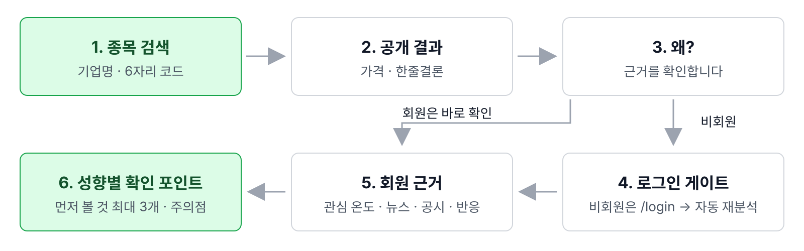

# 화면 설계서

> **한눈에**
> 검색 → 공개 결과 → 회원 근거 → 성향별 확인 순서입니다.
> React 단일 페이지 앱이며, 홈은 `/`, 데모 로그인은 `/login`입니다.
> 가격·한줄결론은 공개합니다. 로그인 후 같은 종목을 회원 토큰으로 재분석합니다.

| 구분 | 대상 | 경로 | 핵심 역할 |
|---|---|---|---|
| 홈 단일 페이지 | 비회원·회원 공통 | `/` | 검색, 공개 결과, 게스트 게이트, 회원 근거, 개인화 결과를 한 흐름으로 표시 |
| 데모 로그인 | 비회원·회원 전환 | `/login` | 투자 성향이 준비된 데모 계정 10개 중 하나를 선택해 로그인 |
| 지원 기업 시트 | 비회원·회원 공통 | `/` 위 모달 | 2026년 9월 1일 기준 KOSPI 시가총액 상위 지원 기업 20개 탐색 |

Frontend는 Backend `/api/v1`만 호출합니다. 브라우저는 MCP Client·MCP 서버·PostgreSQL·Redis에 직접 접근하지 않습니다.

## 1. 한 페이지로 구성한 이유

가격·판단·뉴스·공시를 위아래로 비교합니다. 분석 시작 시 검색 히어로를 줄입니다. 회원의 sticky(스크롤 중 고정) 탭은 네 근거 섹션의 목차입니다.
`access_level`이 `member`일 때만 상세를 렌더합니다. 비회원 계약은 `detail: null`, `personalized_checkpoints: null`입니다. 로그인 전 검색어는 `localStorage`에 보관합니다.

## 2. 화면 이동 흐름

모달·오류·재시도는 상세 도식을 봅니다.

## 3. 공통 레이아웃

| 영역 | 구현 파일 | 표시 내용 | 동작 |
|---|---|---|---|
| 상단 내비게이션 | `frontend/src/components/common/Nav.tsx` | 서비스 로고, Mock 데이터 고지, 로그인 또는 사용자 pill·로그아웃 | 로고는 `/`로 이동합니다. 로그인 전에는 `/login` 링크, 로그인 후에는 사용자명·표시명과 로그아웃 버튼을 보여 줍니다 |
| 홈 조립 | `frontend/src/pages/home/HomePage.tsx` | Hero → Result → Evidence → Personal 순서 | 각 상태에서 필요한 섹션만 조건부 렌더합니다 |
| 검색 상태 저장소 | `frontend/src/state/searchStore.tsx` | 입력값, 제출값, `idle/loading/ready/error`, 결과, 재시도, 실행 번호 | 같은 요청 흐름을 네 홈 섹션이 공유하며 오래된 응답이 새 요청을 덮지 못하게 요청 순서를 확인합니다 |
| 인증 상태 | `frontend/src/state/auth.ts` | Bearer 토큰, 사용자, 프로필 완료 여부와 성향 | `sallae.auth.session` 키로 브라우저 `localStorage`에 저장합니다 |
| 하단 고지 | `frontend/src/pages/home/SiteFooter.tsx` | "본 서비스는 투자 추천이 아닌 정보 제공을 목적으로 합니다." | 회원 개인화 카드 아래에 표시합니다 |

## 4. 화면 명세

| 화면·상태 | 파일 | 로그인 | 목적 | 주요 구성요소 | 호출 API |
|---|---|---|---|---|---|
| 검색 전 홈 | `pages/home/HeroSection.tsx` | X | 지원 종목을 찾고 분석 시작 | 상태형 마스코트, "어떤 종목이 궁금하세요?", 기업명·6자리 종목 코드 검색창, 인기 기업 4개 칩, 지원 20종목 보기 | 인기 칩은 화면 상수, 시트 열기는 `GET /api/v1/companies` |
| 지원 기업 시트 | `components/stock/CompaniesSheet.tsx` | X | 지원 기업 전체 탐색 | 순위·회사명·종목 코드가 있는 20개 버튼, 닫기 버튼, 배경 클릭·`Esc` 닫기 | `GET /api/v1/companies` |
| 분석 중 | `components/stock/LoadingBlock.tsx` | X | 여러 데이터가 모이는 동안 진행 상황 안내 | thinking 마스코트, 가격·뉴스·공시·커뮤니티 진행 칩, 예상 시간 "보통 10초 안팎", 스켈레톤 | `POST /api/v1/analyses` 진행 중 |
| 미지원 종목 | `components/stock/UnsupportedNotice.tsx` | X | 지원 범위와 다음 행동 안내 | oops 마스코트, 미지원 문구, 지원 기업 20개 그리드 | 분석 응답 `status: "unsupported_company"`; 그리드는 고정 fixture 사용 |
| 전체 실패 | `components/stock/ErrorNotice.tsx` | X | 네트워크·서버 오류 복구 | 오류 문구, oops 마스코트, 다시 시도 버튼 | 직전 `POST /api/v1/analyses` 재호출 또는 기업 목록 오류 해제 |
| 공개 결과 | `pages/home/ResultSection.tsx` | X | 비회원도 공통 분석의 핵심 확인 | 종목 코드·시장·회사명, 현재가·등락·기준 시각, 장식용 스파크라인, 한줄결론 말풍선, 앰비언트 키워드, 재료줄, Why 버튼 | 비회원 `POST /api/v1/analyses` 응답의 공개 필드 |
| 비회원 게이트 | `components/stock/GuestGate.tsx` | X | 근거·개인화 영역의 회원 전용 정책 안내 | blur 처리한 게이지 미리보기, "회원가입이 필요합니다!", Mock 계정 로그인 버튼, 검색 종목 복귀 안내 | API 없음. 검색어 저장 후 `/login` 이동 |
| 데모 로그인 | `pages/login/LoginPage.tsx` | X | 성향이 준비된 발표용 사용자 선택 | 마스코트, 데모 계정 10개 카드, 선택 표시, 공통 비밀번호 안내, 로그인 버튼, 보던 종목 복귀 안내 | `POST /api/v1/auth/login`, 성공 후 `GET /api/v1/profile` |
| 회원 근거 시작 | `pages/home/EvidenceSection.tsx` | O | 관심도와 공식 확인 수준을 먼저 요약 | 시장 관심 온도 0~100, 공시·보고서 확인 정도 3단계, 네 개의 sticky 탭 | 회원 `POST /api/v1/analyses`의 `detail` |
| 분위기 vs 근거 | `components/analysis/GapCheckCard.tsx` | O | 관심과 공식 확인의 온도차를 확인 순서로 변환 | 관심 온도·공식 확인 바, 온도차 배지, 뉴스 집중·공시 확인·커뮤니티·가격 신호, 확인 조언 | 별도 호출 없음. 회원 분석 응답으로 화면에서 파생 |
| 커뮤니티 반응 | `components/analysis/EvidenceSubsection.tsx` | O | 사실 자료와 시장 반응을 구분 | 7일 표본 수, 긍정·중립·부정 비율, FGI 반원 게이지와 라벨, 주요 주제 최대 8개, 종토방 집계 고지 | `detail.community_summary`, community source·meta |
| 최신 뉴스 | `components/analysis/EvidenceSubsection.tsx` | O | 기사 요약과 근거 링크 확인 | 요약, 최대 5개 기사, 발행처·시각, 재게재 건수, 원문 링크, 제목만으로 원인 단정 금지 고지 | `detail.news_summary`, news sources |
| 기업보고서·공시 | `components/analysis/EvidenceSubsection.tsx` | O | 공식 자료와 해석을 구분 | 요약, 최대 3개 자료, 접수번호·시각·원문 링크, 확인된 것/아직 확인 안 된 것 패널 | `detail.disclosure_summary`, disclosure sources |
| 부분 실패 | `components/analysis/PartialNotice.tsx` + `EvidenceSubsection.tsx` | O | 가능한 근거는 유지하고 실패 범위만 명시 | Backend `status: partial_success` 띠, 실패 섹션의 제외 이유·다시 시도 | 전체 분석 재시도 |
| 개인화 확인 포인트 | `pages/home/PersonalSection.tsx` + `components/analysis/PersonalCard.tsx` | O | 같은 공통 근거에서 사용자 성향별 확인 순서 제공 | 사용자명, 안정/균형/공격·단/중/장기·경험 라벨, 개인화 요약, "먼저 볼 것" 최대 3개, 주의점 | `personalized_checkpoints`, 로그인 때 조회한 profile |

파일은 `frontend/src/`, 홈 상태는 `/` 기준입니다.

## 5. 검색과 공개 결과의 상태 설계

마스코트는 `idle`, typing, submit, thinking, oops로 바뀝니다. 제출 후에도 검색창은 남깁니다. 삼성전자·SK하이닉스·현대차·셀트리온 칩은 화면 상수입니다.

가격·등락·서울 기준 시각은 부호와 색으로 표시합니다. 스파크라인(작은 추세선)은 `stock_code` seed·`change_rate`로 만든 장식이며 시계열 연결은 후순위입니다.

한줄결론은 추천 없이 가격·뉴스·공시·커뮤니티를 연결합니다. 회원 재료줄은 `sources` 건수, 키워드는 community 집계 주제입니다. 비회원 `topics_preview`는 mock 전용 계약 외 필드이며 live에 없으면 숨깁니다.

## 6. 회원 게이트와 로그인 복귀

| 순서 | 저장·판정 기준 | 화면 동작 |
|---|---|---|
| 1 | 분석 응답의 `access_level` 확인 | `guest`이면 공개 결과만, `member`이면 근거·개인화를 렌더합니다 |
| 2 | 비회원이 Why 버튼 선택 | 실제 근거 대신 blur 미리보기와 로그인 안내 카드를 펼칩니다 |
| 3 | Mock 계정 로그인 선택 | 현재 검색어를 `sallae.search.pendingQuery`에 저장하고 `/login`으로 이동합니다 |
| 4 | 데모 사용자 선택·로그인 | 공통 비밀번호로 로그인하고, 프로필 조회는 실패해도 로그인 자체는 유지합니다 |
| 5 | `/` 복귀 | 토큰 변경을 감지해 보류 검색어를 회원 요청으로 자동 재분석합니다 |
| 6 | 회원이 Why 버튼 선택 | `#evidence`로 부드럽게 스크롤합니다 |

"회원가입이 필요합니다!" 버튼은 현재 **Mock 계정 로그인**입니다. 실제 회원가입은 후순위입니다.

## 7. 근거와 개인화 화면

### 7.1 요약 게이지

`market_temperature.score`는 0~100으로 제한합니다. 거래량·커뮤니티 글 수의 평소 대비 비율, 기간 내 뉴스 건수, 공포탐욕 강도를 정규화해 합칩니다.

| 조건 | 표시 문구·규칙 |
|---|---|
| 커뮤니티 포함 | "거래량 변화 · 뉴스 기사량 · 커뮤니티 글 수 · 공포탐욕 강도 기준. 이 종목의 평소 대비예요. 상승 가능성이 아니에요." |
| 커뮤니티 제외 | "거래량 변화 · 뉴스 기사량 기준 (커뮤니티 제외)" |
| `weight_covered < 100` | 미가용 항목을 빼고 재정규화합니다. "일부 자료를 못 받아 받은 자료만으로 계산했어요."를 추가하며 가용 배점 숫자는 숨깁니다 |
| `evidence_level.level` | 낮음="아직 조금", 중간="절반쯤", 높음="많이 확인됨" |
| 확인 단계의 뜻 | 최근 30일 주요 비정기 공시와 현재 뉴스·커뮤니티 이슈의 직접 연결 여부입니다 |
| 캡션 | "뉴스 내용이 공시·보고서로 뒷받침되는 정도" |
| 이슈·배지 | 연결은 `confirmed`, 미연결은 `unconfirmed` 패널입니다. 공시에 주요 공시·정기 배지를 붙입니다 |

### 7.2 분위기 vs 근거

관심 온도·공시 확인 단계로 `온도차 큼`, `온도차 있음`, `비슷함`, `조용한 편`을 표시합니다. 뉴스 집중·재게재·공식 확인·커뮤니티 긍정 비율·당일 가격 변화를 보조 신호로 씁니다. Frontend 표시용 휴리스틱(간단한 판정 규칙)이며 Backend/MCP Client의 독립 계약 필드는 아닙니다.

### 7.3 근거 섹션과 sticky 탭

분위기 vs 근거 → 커뮤니티 반응 → 최신 뉴스 → 기업보고서·공시 순서입니다. `IntersectionObserver`로 현재 탭을 강조하고 클릭 시 이동합니다. 내비게이션 높이로 offset(간격)을 계산해 제목 겹침을 막습니다.
요약 옆에 출처를 둡니다. 뉴스는 링크·재게재 횟수, 공시는 접수번호·확인/미확인, 커뮤니티는 표본·비율·FGI(공포탐욕지수)·집계 주제와 "사실이 아닌 시장 반응" 고지를 표시합니다.

### 7.4 개인화 카드

공통 근거는 유지하고 확인 순서만 바꿉니다. 세션의 위험 성향·기간·경험 라벨, `personal_summary` 첫 문장 강조·나머지 부연, `priority_checks` 최대 3개 번호 카드, 마지막 `caution` 순서입니다.
`profile_completed: false`이면 "성향 설정이 필요해요"만 표시합니다. 등록·수정 폼은 후순위입니다.

## 8. 오류와 부분 실패

| 상태 | 판정 | 유지하는 내용 | 사용자가 할 수 있는 일 |
|---|---|---|---|
| 미지원 | `status: "unsupported_company"` | 검색창과 지원 기업 20개 목록 | 지원 기업을 선택해 다시 분석 |
| 전체 실패 | 분석 요청 예외 | 입력한 검색어 | "다시 시도"로 같은 분석 재호출 |
| 기업 목록 실패 | 지원 기업 API 예외 | 검색창과 인기 기업 칩 | 오류를 닫고 검색어 직접 입력 |
| 부분 실패 | Backend `partial_success` 또는 개별 summary·coverage 누락 | 가격, 한줄결론, 성공한 근거, 개인화 | 실패 섹션의 "다시 시도"로 전체 분석 재호출 |

커뮤니티 누락 시 카드에 제외 이유를 표시합니다. 온도 설명도 바꾸고 뉴스·공시·가격은 유지합니다.

## 9. 반응형·접근성·모션

| 항목 | 구현 규칙 |
|---|---|
| 모바일 기준 | 저장된 검증 화면은 390px입니다. 가격 헤더와 게이지는 1열, 커뮤니티 비율 3개와 공시 확인 패널도 1열로 재배치합니다 |
| 검색 버튼 | 560px 이하에서는 "살펴보기" 글자를 시각적으로 숨기고 화살표 아이콘을 유지합니다. 입력창의 접근성 이름은 계속 제공됩니다 |
| 로그인 카드 | 데스크톱 5열×2행, 480px 이하 2열로 표시합니다 |
| 근거 탭 | 가로 공간이 좁으면 탭 행만 가로 스크롤합니다. 본문 전체의 가로 스크롤은 허용하지 않습니다 |
| 지원 기업 시트 | 데스크톱 4열, 760px 이하 2열, 480px 이하 1열입니다 |
| 키워드 | 데스크톱은 결론 주변 최대 12개, 모바일은 네 귀퉁이 최대 4개로 줄입니다 |
| 빼꼼 마스코트 | 회원 근거에 들어오면 화면 왼쪽 아래에 나타나며, 누르면 맨 위로 이동합니다. 개인화 영역에 오면 wink 상태로 바뀝니다 |
| 모션 감소 | `prefers-reduced-motion: reduce`이면 무한 부유·게이지 지연·전환 애니메이션을 제거하거나 즉시 완료 상태로 표시합니다 |
| 키보드·의미 구조 | 버튼과 링크를 실제 HTML 요소로 구현하고, 모달은 `role="dialog"`, 오류는 `role="alert"`, 현재 근거 탭은 `aria-current`로 표시합니다 |

## 10. 설계 포인트

매수·매도 대신 확인 순서를 제공합니다. 분위기·사실·누락 영향을 구분합니다.
상단에 "Mock 데이터 · 실제 투자 정보 아님"을 표시합니다. preview·장식 선을 실데이터로 설명하지 않습니다. 모션은 진행·정보 계층을 알리며 OS 모션 감소 설정을 따릅니다.

## 상세

## 11. 현재 범위·코드 차이와 후순위

| 항목 | 현재 상태 | 비고 |
|---|---|---|
| 지원 기업 검색 | 구현 | 기업명 또는 6자리 종목 코드 입력, 지원 20개 탐색 |
| 비회원 공개 결과 | 구현 | 회사·가격·등락·한줄결론 공개 |
| 회원 근거·개인화 | 구현 | 네 근거 섹션, 게이지, 출처, 확인 포인트 |
| 데모 계정 로그인 | 구현 | 계정 10개, 공통 비밀번호, 원래 종목 자동 복귀 |
| 미지원·전체 실패·부분 실패 | 구현 | 각 전용 상태와 재시도 제공 |
| 모바일 390px·모션 감소 | 구현·자동 검증 | 저장 화면 및 headless E2E 검증 포함 |
| 부분 성공 상태명 | **정합화 완료(PR #33)** | MCP Client·Backend·Frontend 모두 `partial_success`를 사용합니다. live에서 부분 실패 띠가 정상 표시됩니다 |
| 프로필 응답 봉투 | **정합화 완료(PR #33)** | Backend `GET/PUT /profile`은 raw `InvestmentProfile`을 반환하고, Frontend live client가 이를 `{status, profile}`로 감싸 세션에 싣습니다 |
| 실제 회원가입 | **후순위** | 계약 엔드포인트는 있으나 Frontend 화면·라우트 없음 |
| 투자 성향 등록·수정 | **후순위** | API client 메서드는 있으나 폼·라우트 없음 |
| 실제 과거 가격 스파크라인 | **후순위** | 현재는 종목 코드와 등락 방향으로 생성한 장식용 선 |
| 분석 이력·포트폴리오·주문·관리자 | **범위 제외** | 현재 Frontend에 화면·라우트 없음 |

## 12. 구현 근거와 검증 체크리스트

### 12.1 저장 화면

| 검증 화면 | 파일 | 확인 항목 |
|---|---|---|
| 데스크톱 초기 | `frontend/tests/shots/desktop-idle.png` | 검색 히어로, 마스코트, 인기 기업 칩, 로그인 |
| 데스크톱 로딩 | `frontend/tests/shots/desktop-loading.png` | 진행 칩, 예상 시간, 스켈레톤 |
| 데스크톱 비회원 결과 | `frontend/tests/shots/desktop-guest.png` | 가격, 스파크라인, 한줄결론, Why 버튼 |
| 데스크톱 게이트 | `frontend/tests/shots/desktop-gate.png` | blur 미리보기, Mock 로그인 CTA |
| 데스크톱 로그인 | `frontend/tests/shots/desktop-login.png` | 데모 계정 10개 5×2 배열 |
| 데스크톱 회원 | `frontend/tests/shots/desktop-member.png` | 단일 페이지 전체 회원 흐름 |
| 데스크톱 커뮤니티 | `frontend/tests/shots/desktop-community.png` | sticky 탭, 반응 비율, FGI, 주요 주제 |
| 데스크톱 부분 실패 | `frontend/tests/shots/desktop-partial.png` | 부분 실패 띠, 실패 섹션, 성공 근거 유지 |
| 모바일 초기 | `frontend/tests/shots/mobile-idle.png` | 390px 검색 레이아웃, 가로 넘침 없음 |
| 모바일 회원 | `frontend/tests/shots/mobile-member.png` | 1열 게이지·근거·개인화 전체 흐름 |

`frontend/tests/shots.mjs`는 headless Chromium으로 10장을 생성합니다. 미지원·전체 실패, 모바일 게이트·로그인, 모션 감소는 저장 이미지 없이 smoke(기본 동작)·레이아웃 검증합니다.

### 12.2 체크리스트

라우트·상태·계약·로그인 복귀·mock·스크롤·재시도·반응형·모션·저장 화면을 대조했습니다. live 정합화 두 건·미구현 항목은 11절 기준입니다.

## 13. 참고 경로

- 화면 흐름 원문: `docs/specs/FRONTEND_FLOW.md`
- Frontend 실행: 루트 `README.md` 3절
- Frontend ↔ Backend 계약: `docs/specs/contracts/frontend_backend.md`
- 라우트 조립: `frontend/src/App.tsx`
- 화면 컴포넌트: `frontend/src/pages/`, `frontend/src/components/`
- 스크린샷·E2E: `frontend/tests/shots.mjs`, `frontend/tests/shots/`

### 상세 화면 이동 도식

[밝은 SVG](../architecture/diagrams/user-app-flow.svg) · [어두운 SVG](../architecture/diagrams/user-app-flow-dark.svg) · [Mermaid 원본](../architecture/diagrams/user-app-flow.mmd)

부분 성공 상태는 도식과 현재 계약 모두 `partial_success`입니다.
